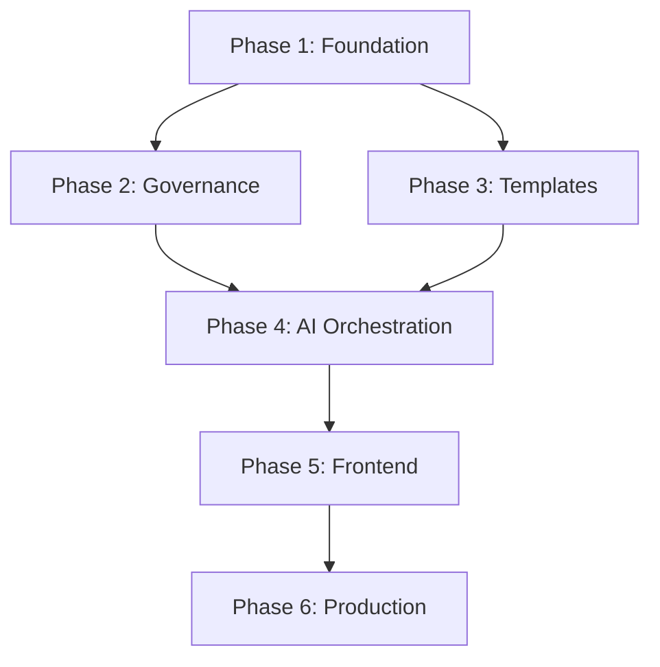

# AI Development Assistant - Implementation Phases

## Overview

This document defines the implementation phases for the AI Development Assistant platform. Each phase has specific deliverables, success criteria, and a mandatory test-commit-push workflow.

## Phase Structure

Each phase follows this structure:
1. **Planning** - Architecture review and task breakdown
2. **Implementation** - Code development with TDD
3. **Testing** - Comprehensive test execution
4. **Validation** - Governance and quality checks
5. **Deployment** - Commit, push, and deploy

---

# PHASE 1: Foundation Layer
**Duration**: 3 Days  
**Start Date**: 2025-09-02  
**End Date**: 2025-09-04  

## Objectives
- Establish core database schema
- Implement basic CRUD APIs
- Setup testing infrastructure
- Create governance foundation

## Deliverables

### Day 1: Database & Models
```python
deliverables = {
    "database": [
        "PostgreSQL setup with Docker",
        "SQLAlchemy models for all entities",
        "Alembic migration system",
        "Database seeding scripts"
    ],
    "models": [
        "Rule model with validation",
        "Practice model with scoring",
        "Template model with variables",
        "Session model with lifecycle"
    ],
    "tests": [
        "Model unit tests (100% coverage)",
        "Database integration tests",
        "Migration tests"
    ]
}
```

### Day 2: Core APIs
```python
endpoints = {
    "/api/rules": ["GET", "POST", "PUT", "DELETE"],
    "/api/practices": ["GET", "POST", "PUT", "DELETE"],
    "/api/templates": ["GET", "POST", "PUT", "DELETE"],
    "/api/sessions": ["GET", "POST", "PUT", "DELETE"]
}
```

### Day 3: Testing & Documentation
- Complete test coverage (>85%)
- API documentation (OpenAPI)
- Integration test suite
- Performance baselines

## Success Criteria
- [ ] All database models created and tested
- [ ] CRUD APIs functional with validation
- [ ] Test coverage > 85%
- [ ] All tests passing
- [ ] Documentation complete

## Phase 1 Completion Checklist
```bash
# Run this before marking Phase 1 complete
./validate-phase-1.sh

✓ Database migrations up to date
✓ All models have tests
✓ API endpoints responding
✓ Coverage > 85%
✓ No linting errors
✓ Documentation generated
```

---

# PHASE 2: Governance Engine
**Duration**: 3 Days  
**Start Date**: 2025-09-05  
**End Date**: 2025-09-07  

## Objectives
- Implement three-tier governance
- Create rule evaluation engine
- Setup enforcement mechanisms
- Build audit system

## Deliverables

### Day 1: Pre-Action Governance
```python
components = {
    "validators": [
        "PermissionValidator",
        "SessionValidator",
        "ResourceValidator",
        "RuleComplianceValidator"
    ],
    "enforcers": [
        "BlockingEnforcer",
        "WarningEnforcer",
        "ApprovalEnforcer"
    ]
}
```

### Day 2: Action Monitoring
```python
monitors = {
    "real_time": [
        "DecisionTracker",
        "ResourceMonitor",
        "AnomalyDetector",
        "ProgressTracker"
    ],
    "storage": [
        "EventStore",
        "MetricsCollector",
        "AuditLogger"
    ]
}
```

### Day 3: Post-Action Validation
```python
validators = {
    "outcome": "OutcomeVerifier",
    "compliance": "ComplianceChecker",
    "quality": "QualityAnalyzer",
    "feedback": "FeedbackProcessor"
}
```

## Success Criteria
- [ ] Pre-action checks blocking violations
- [ ] Real-time monitoring operational
- [ ] Post-action validation working
- [ ] Audit trail complete
- [ ] Performance within targets

---

# PHASE 3: Template System
**Duration**: 3 Days  
**Start Date**: 2025-09-08  
**End Date**: 2025-09-10  

## Objectives
- Build template management system
- Implement variable substitution
- Create template validation
- Setup template versioning

## Deliverables

### Day 1: Template Engine
```python
engine_components = {
    "parser": "TemplateParser",
    "validator": "TemplateValidator",
    "substitutor": "VariableSubstitutor",
    "renderer": "TemplateRenderer"
}
```

### Day 2: Template Management
```python
management = {
    "crud": "Full CRUD operations",
    "versioning": "Git-like versioning",
    "categories": "Hierarchical categories",
    "search": "Full-text search"
}
```

### Day 3: Template UI
```typescript
ui_components = {
    "editor": "MonacoEditor integration",
    "preview": "Live preview panel",
    "variables": "Variable management UI",
    "library": "Template library browser"
}
```

## Success Criteria
- [ ] Template CRUD working
- [ ] Variable substitution functional
- [ ] Validation preventing errors
- [ ] UI components integrated
- [ ] Search and categorization working

---

# PHASE 4: AI Orchestration
**Duration**: 4 Days  
**Start Date**: 2025-09-11  
**End Date**: 2025-09-14  

## Objectives
- Integrate AI providers
- Build orchestration engine
- Implement persona system
- Create decision tracking

## Deliverables

### Day 1: AI Integration
```python
integrations = {
    "providers": [
        "OpenAI GPT-4",
        "Anthropic Claude",
        "Local LLM support"
    ],
    "abstraction": "ProviderAgnosticInterface",
    "fallback": "Multi-provider fallback"
}
```

### Day 2: Orchestration Engine
```python
orchestrator = {
    "task_router": "Route tasks to appropriate AI",
    "persona_selector": "Auto-select best persona",
    "context_manager": "Maintain conversation context",
    "decision_tracker": "Track all AI decisions"
}
```

### Day 3: Persona System
```python
personas = {
    "definitions": "10+ specialist personas",
    "selection": "ML-based selection",
    "customization": "User-defined personas",
    "effectiveness": "Performance tracking"
}
```

### Day 4: Integration & Testing
- End-to-end orchestration tests
- Performance optimization
- Fallback scenarios
- Error handling

## Success Criteria
- [ ] AI providers integrated
- [ ] Orchestration routing working
- [ ] Personas selecting correctly
- [ ] Decisions being tracked
- [ ] Performance < 2s response

---

# PHASE 5: Frontend Integration
**Duration**: 4 Days  
**Start Date**: 2025-09-15  
**End Date**: 2025-09-18  

## Objectives
- Build Angular components
- Integrate with backend APIs
- Implement real-time updates
- Create responsive UI

## Deliverables

### Day 1: Core Components
```typescript
components = [
    "DashboardComponent",
    "RuleManagementComponent",
    "TemplateEditorComponent",
    "GovernanceMonitorComponent"
]
```

### Day 2: Service Layer
```typescript
services = [
    "ApiService",
    "WebSocketService",
    "StateManagementService",
    "CacheService"
]
```

### Day 3: Real-time Features
```typescript
realtime = {
    "websocket": "WebSocket connection",
    "updates": "Live data updates",
    "notifications": "Push notifications",
    "collaboration": "Multi-user support"
}
```

### Day 4: Polish & Optimization
- Performance optimization
- Responsive design
- Accessibility (WCAG 2.1)
- Cross-browser testing

## Success Criteria
- [ ] All components rendering
- [ ] API integration working
- [ ] Real-time updates functional
- [ ] Performance < 2s load time
- [ ] Responsive on all devices

---

# PHASE 6: Production Readiness
**Duration**: 3 Days  
**Start Date**: 2025-09-19  
**End Date**: 2025-09-21  

## Objectives
- Security hardening
- Performance optimization
- Deployment automation
- Monitoring setup

## Deliverables

### Day 1: Security
```yaml
security:
  - Authentication system
  - Authorization (RBAC)
  - Input validation
  - SQL injection prevention
  - XSS protection
  - CSRF tokens
  - Rate limiting
  - Audit logging
```

### Day 2: Performance
```yaml
optimization:
  - Database indexing
  - Query optimization
  - Caching strategy
  - CDN setup
  - Code splitting
  - Lazy loading
  - Image optimization
  - Compression
```

### Day 3: Deployment
```yaml
deployment:
  - Docker containers
  - Kubernetes manifests
  - CI/CD pipeline
  - Monitoring setup
  - Alerting rules
  - Backup strategy
  - Disaster recovery
  - Documentation
```

## Success Criteria
- [ ] Security scan passing
- [ ] Performance targets met
- [ ] Deployment automated
- [ ] Monitoring operational
- [ ] Documentation complete

---

## Phase Completion Workflow

### Mandatory Steps for Each Phase

```bash
#!/bin/bash
# phase-completion.sh

echo "=== PHASE COMPLETION CHECKLIST ==="

# 1. Run all tests
echo "[1/7] Running tests..."
npm test -- --coverage
pytest --cov

# 2. Check coverage
echo "[2/7] Checking coverage..."
npm run coverage:check
pytest --cov-fail-under=85

# 3. Run linters
echo "[3/7] Running linters..."
npm run lint
black . && flake8 .

# 4. Run security scan
echo "[4/7] Security scan..."
npm audit
safety check

# 5. Update documentation
echo "[5/7] Updating docs..."
npm run docs:generate
sphinx-build -b html docs docs/_build

# 6. Commit changes
echo "[6/7] Committing..."
git add -A
git commit -m "feat: Complete Phase X - <description>

- Deliverables completed
- Tests passing (XX% coverage)
- Documentation updated
- Security scan clean

Co-Authored-By: Team"

# 7. Push to repository
echo "[7/7] Pushing..."
git push origin main

echo "=== PHASE COMPLETE ==="
```

### Quality Gates

Each phase must pass these gates:

| Gate | Requirement | Tool |
|------|------------|------|
| Test Coverage | > 85% | Jest/pytest |
| Code Quality | A rating | SonarQube |
| Security | No high/critical | OWASP/Snyk |
| Performance | Within targets | Lighthouse |
| Documentation | Complete | Compodoc/Sphinx |
| Governance | Compliant | Custom engine |

---

## Risk Mitigation

### Phase Risks and Mitigations

| Phase | Risk | Mitigation |
|-------|------|------------|
| 1 | Database schema changes | Use migrations, version control |
| 2 | Governance too restrictive | Configurable rules, override capability |
| 3 | Template complexity | Validation, examples, documentation |
| 4 | AI provider failures | Multi-provider fallback, caching |
| 5 | Frontend performance | Code splitting, lazy loading |
| 6 | Security vulnerabilities | Regular scanning, updates |

---

## Tracking and Reporting

### Daily Standup Template
```markdown
## Date: YYYY-MM-DD
## Phase: X
## Day: Y of Z

### Completed Yesterday
- [ ] Task 1
- [ ] Task 2

### Planned Today
- [ ] Task 3
- [ ] Task 4

### Blockers
- None / Description

### Metrics
- Coverage: XX%
- Tests: XXX passing
- Build: Green/Red
```

### Phase Report Template
```markdown
## Phase X Completion Report

### Deliverables
- ✅ Deliverable 1
- ✅ Deliverable 2
- ⚠️ Deliverable 3 (partial)

### Metrics
- Coverage: 87%
- Tests: 234 passing, 0 failing
- Performance: 1.8s load time
- Security: 0 vulnerabilities

### Lessons Learned
- What went well
- What could improve
- Action items

### Next Phase Readiness
- [ ] Dependencies resolved
- [ ] Team briefed
- [ ] Environment ready
```

---

## Success Metrics

### Overall Project Success Criteria

```python
success_metrics = {
    "technical": {
        "test_coverage": ">= 85%",
        "performance": "< 2s response time",
        "availability": ">= 99.9%",
        "security": "0 critical vulnerabilities"
    },
    "business": {
        "feature_completion": "100%",
        "documentation": "Complete",
        "training": "Delivered",
        "handover": "Successful"
    },
    "quality": {
        "code_quality": "A rating",
        "bug_density": "< 1 per KLOC",
        "technical_debt": "< 5%",
        "user_satisfaction": "> 4/5"
    }
}
```

---

## Appendices

### A. Phase Dependencies



### B. Resource Allocation

| Phase | Backend | Frontend | DevOps | QA |
|-------|---------|----------|--------|----|
| 1 | 80% | 10% | 10% | 0% |
| 2 | 70% | 10% | 10% | 10% |
| 3 | 40% | 40% | 10% | 10% |
| 4 | 60% | 20% | 10% | 10% |
| 5 | 20% | 60% | 10% | 10% |
| 6 | 20% | 20% | 40% | 20% |

### C. Toolchain

| Category | Tools |
|----------|-------|
| Development | VS Code, PyCharm, WebStorm |
| Testing | Jest, pytest, Cypress |
| CI/CD | GitHub Actions, Jenkins |
| Monitoring | Prometheus, Grafana |
| Documentation | Sphinx, Compodoc |

---

*Document Version: 1.0.0*  
*Last Updated: 2025-09-01*  
*Authors: Jordan Kim, Marcus Rivera*  
*Status: Active Implementation Plan*