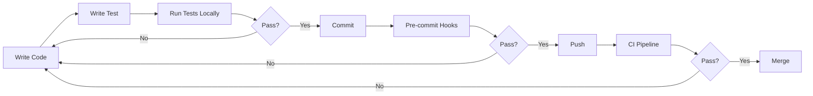

# AI Development Assistant - Testing Strategy

## Executive Summary

This document defines the comprehensive testing strategy for the AI Development Assistant platform. We employ a multi-layered testing approach with mandatory coverage requirements and automated enforcement through CI/CD pipelines.

## Table of Contents

1. [Testing Philosophy](#testing-philosophy)
2. [Testing Pyramid](#testing-pyramid)
3. [Test Categories](#test-categories)
4. [Coverage Requirements](#coverage-requirements)
5. [Testing Infrastructure](#testing-infrastructure)
6. [Test Automation](#test-automation)
7. [Testing Workflows](#testing-workflows)
8. [Quality Gates](#quality-gates)

---

## Testing Philosophy

### Core Principles

1. **Test-Driven Development (TDD)**
   - Write tests before implementation
   - Red-Green-Refactor cycle
   - Tests as living documentation

2. **Shift-Left Testing**
   - Test early and often
   - Catch issues before production
   - Developer-owned quality

3. **Comprehensive Coverage**
   - Multiple test layers
   - Edge case validation
   - Failure mode testing

4. **Automation First**
   - Automated test execution
   - Continuous validation
   - Minimal manual testing

---

## Testing Pyramid

```
         /\
        /  \  E2E Tests (5%)
       /────\  - User journeys
      /      \  - Critical paths
     /────────\
    /          \  Integration Tests (20%)
   /────────────\  - API contracts
  /              \  - Service interactions
 /────────────────\
/                  \  Unit Tests (75%)
────────────────────  - Business logic
                      - Isolated components
                      - Pure functions
```

### Test Distribution Guidelines

| Test Type | Coverage Target | Execution Time | Frequency |
|-----------|----------------|----------------|-----------|
| Unit | 85% | < 5 min | Every commit |
| Integration | 70% | < 15 min | Every PR |
| E2E | Critical paths | < 30 min | Before deploy |
| Performance | Benchmarks | < 1 hour | Nightly |
| Security | OWASP Top 10 | < 2 hours | Weekly |

---

## Test Categories

### 1. Unit Tests

```python
# Backend Unit Test Example
class TestGovernanceEngine:
    """Unit tests for governance engine"""
    
    def test_rule_validation(self):
        """Test that rules are properly validated"""
        # Arrange
        rule = Rule(name="test", condition="always", action="log")
        engine = GovernanceEngine()
        
        # Act
        result = engine.validate_rule(rule)
        
        # Assert
        assert result.is_valid
        assert result.confidence > 0.8
    
    def test_rule_enforcement(self):
        """Test rule enforcement logic"""
        # Test implementation
        pass
```

```typescript
// Frontend Unit Test Example
describe('TemplateService', () => {
  let service: TemplateService;
  
  beforeEach(() => {
    TestBed.configureTestingModule({});
    service = TestBed.inject(TemplateService);
  });
  
  it('should substitute variables correctly', () => {
    // Arrange
    const template = 'Hello {{name}}!';
    const variables = { name: 'World' };
    
    // Act
    const result = service.substitute(template, variables);
    
    // Assert
    expect(result).toBe('Hello World!');
  });
});
```

### 2. Integration Tests

```python
# API Integration Test
@pytest.mark.integration
class TestRulesAPI:
    """Integration tests for rules API"""
    
    @pytest.fixture
    def client(self):
        """Test client with database"""
        return TestClient(app)
    
    def test_create_and_retrieve_rule(self, client):
        """Test full rule lifecycle"""
        # Create rule
        response = client.post("/api/rules/", json={
            "name": "test_rule",
            "description": "Test rule",
            "condition": "file.extension == '.py'",
            "action": "validate"
        })
        assert response.status_code == 201
        rule_id = response.json()["id"]
        
        # Retrieve rule
        response = client.get(f"/api/rules/{rule_id}")
        assert response.status_code == 200
        assert response.json()["name"] == "test_rule"
```

### 3. End-to-End Tests

```typescript
// E2E Test with Cypress
describe('Governance Workflow', () => {
  it('should enforce rules during code submission', () => {
    // Login
    cy.login('developer@test.com', 'password');
    
    // Navigate to code editor
    cy.visit('/editor');
    
    // Write code
    cy.get('[data-cy=code-editor]').type('def test():\n    pass');
    
    // Submit for validation
    cy.get('[data-cy=validate-button]').click();
    
    // Verify governance check
    cy.get('[data-cy=governance-result]').should('contain', 'Missing docstring');
    
    // Fix issue
    cy.get('[data-cy=code-editor]').clear().type('def test():\n    """Test function"""\n    pass');
    
    // Resubmit
    cy.get('[data-cy=validate-button]').click();
    
    // Verify success
    cy.get('[data-cy=governance-result]').should('contain', 'Approved');
  });
});
```

### 4. Performance Tests

```python
# Performance Test with Locust
from locust import HttpUser, task, between

class APIUser(HttpUser):
    wait_time = between(1, 3)
    
    @task(3)
    def get_rules(self):
        """Test rules endpoint performance"""
        with self.client.get("/api/rules/", 
                            catch_response=True) as response:
            if response.elapsed.total_seconds() > 0.2:
                response.failure(f"Too slow: {response.elapsed.total_seconds()}s")
    
    @task(1)
    def create_rule(self):
        """Test rule creation performance"""
        self.client.post("/api/rules/", json={
            "name": f"perf_test_{time.time()}",
            "condition": "always",
            "action": "log"
        })
```

### 5. Security Tests

```python
# Security Test Suite
class TestSecurity:
    """Security test suite"""
    
    def test_sql_injection(self, client):
        """Test SQL injection prevention"""
        malicious_input = "'; DROP TABLE rules; --"
        response = client.get(f"/api/rules/search?q={malicious_input}")
        assert response.status_code in [200, 400]
        # Verify table still exists
        assert client.get("/api/rules/").status_code == 200
    
    def test_xss_prevention(self, client):
        """Test XSS prevention"""
        xss_payload = "<script>alert('XSS')</script>"
        response = client.post("/api/rules/", json={
            "name": xss_payload,
            "condition": "always",
            "action": "log"
        })
        # Verify payload is escaped in response
        assert "<script>" not in response.text
    
    def test_authentication_required(self, client):
        """Test auth enforcement"""
        response = client.get("/api/rules/", headers={})
        assert response.status_code == 401
```

---

## Coverage Requirements

### Mandatory Coverage Levels

| Component | Unit | Integration | E2E | Total |
|-----------|------|-------------|-----|-------|
| Backend Services | 85% | 70% | N/A | 80% |
| Frontend Components | 80% | 60% | N/A | 75% |
| API Endpoints | 90% | 85% | 50% | 85% |
| Governance Engine | 95% | 80% | N/A | 90% |
| Critical Paths | 100% | 100% | 100% | 100% |

### Coverage Enforcement

```yaml
# .github/workflows/test.yml
coverage:
  fail_under:
    global: 80
    backend: 85
    frontend: 75
  
  exclude:
    - "*/migrations/*"
    - "*/test_*.py"
    - "*.spec.ts"
    
  reports:
    - lcov
    - html
    - json
```

---

## Testing Infrastructure

### Test Environments

```yaml
environments:
  local:
    database: SQLite (in-memory)
    cache: Mock Redis
    external_services: Mocked
    
  ci:
    database: PostgreSQL (Docker)
    cache: Redis (Docker)
    external_services: Mocked
    
  staging:
    database: PostgreSQL (Cloud)
    cache: Redis (Cloud)
    external_services: Sandboxed
    
  production:
    monitoring_only: true
    synthetic_tests: enabled
    chaos_engineering: scheduled
```

### Test Data Management

```python
# Test Data Factory
class TestDataFactory:
    """Generate test data"""
    
    @staticmethod
    def create_user(**kwargs):
        defaults = {
            "email": f"test_{uuid.uuid4()}@example.com",
            "name": "Test User",
            "role": "developer"
        }
        return User(**{**defaults, **kwargs})
    
    @staticmethod
    def create_rule(**kwargs):
        defaults = {
            "name": f"rule_{uuid.uuid4()}",
            "condition": "always",
            "action": "log",
            "severity": "info"
        }
        return Rule(**{**defaults, **kwargs})
```

### Test Fixtures

```python
# Shared Fixtures
@pytest.fixture(scope="session")
def database():
    """Test database"""
    db = create_test_database()
    yield db
    db.cleanup()

@pytest.fixture
def authenticated_client(database):
    """Client with auth"""
    client = TestClient(app)
    token = create_test_token()
    client.headers["Authorization"] = f"Bearer {token}"
    return client

@pytest.fixture
def mock_ai_service():
    """Mock AI service"""
    with patch("services.ai_service") as mock:
        mock.complete.return_value = "Mocked response"
        yield mock
```

---

## Test Automation

### CI/CD Pipeline

```yaml
# GitHub Actions Pipeline
name: Test Pipeline

on: [push, pull_request]

jobs:
  test:
    runs-on: ubuntu-latest
    
    steps:
      - uses: actions/checkout@v3
      
      - name: Setup
        run: |
          npm ci
          pip install -r requirements.txt
      
      - name: Lint
        run: |
          npm run lint
          black --check .
          flake8 .
      
      - name: Unit Tests
        run: |
          npm test -- --coverage
          pytest tests/unit --cov
      
      - name: Integration Tests
        run: |
          docker-compose up -d
          pytest tests/integration
      
      - name: E2E Tests
        run: |
          npm run e2e:ci
      
      - name: Coverage Report
        run: |
          npm run coverage:report
          pytest --cov-report=xml
      
      - name: Upload Coverage
        uses: codecov/codecov-action@v3
```

### Test Execution Strategy

```bash
# Local Development
make test           # Run all tests
make test-unit      # Unit tests only
make test-watch     # Watch mode
make test-debug     # Debug mode

# Pre-commit
npm test -- --bail  # Stop on first failure
pytest --fail-fast  # Stop on first failure

# CI/CD
npm test -- --ci --coverage
pytest --cov --junit-xml=report.xml

# Nightly
npm run test:all
pytest --slow --benchmark
```

---

## Testing Workflows

### Developer Workflow



### Test Development Process

1. **Identify Test Case**
   - Review requirements
   - Identify edge cases
   - Consider failure modes

2. **Write Test**
   - Follow AAA pattern (Arrange, Act, Assert)
   - Use descriptive names
   - One assertion per test

3. **Implement Feature**
   - Minimal implementation
   - Make test pass
   - Refactor if needed

4. **Review & Refactor**
   - Code review
   - Test review
   - Performance optimization

---

## Quality Gates

### Pre-Commit Gates

```python
# .pre-commit-config.yaml
repos:
  - repo: local
    hooks:
      - id: test-coverage
        name: Test Coverage Check
        entry: pytest --cov --cov-fail-under=80
        language: system
        pass_filenames: false
        
      - id: lint-check
        name: Lint Check
        entry: npm run lint
        language: system
        pass_filenames: false
```

### PR Merge Gates

| Gate | Requirement | Enforcement |
|------|------------|-------------|
| Unit Tests | 100% pass | Blocking |
| Integration Tests | 100% pass | Blocking |
| Coverage | >= 80% | Blocking |
| Code Review | 2 approvals | Blocking |
| Security Scan | No high/critical | Blocking |
| Performance | No regression | Warning |

### Deployment Gates

```yaml
deployment_gates:
  staging:
    - all_tests_pass: true
    - coverage_threshold: 80
    - security_scan: pass
    - smoke_tests: pass
    
  production:
    - staging_validation: 24h
    - canary_deployment: pass
    - rollback_plan: approved
    - monitoring_alerts: configured
```

---

## Test Reporting

### Dashboard Metrics

```python
test_metrics = {
    "coverage": {
        "overall": 82.5,
        "backend": 85.3,
        "frontend": 78.9,
        "trend": "+2.1%"
    },
    "execution": {
        "total_tests": 1847,
        "passed": 1823,
        "failed": 24,
        "skipped": 0,
        "duration": "12m 34s"
    },
    "quality": {
        "flaky_tests": 3,
        "slow_tests": 15,
        "test_debt": 47,
        "maintainability": "A"
    }
}
```

### Test Reports

1. **Daily Report**
   - Test execution summary
   - Coverage changes
   - Failed tests analysis

2. **Weekly Report**
   - Trend analysis
   - Flaky test identification
   - Performance benchmarks

3. **Monthly Report**
   - Test effectiveness
   - Coverage gaps
   - Test maintenance needs

---

## Testing Best Practices

### Do's

✅ Write tests first (TDD)  
✅ Keep tests simple and focused  
✅ Use descriptive test names  
✅ Test edge cases and error conditions  
✅ Maintain test independence  
✅ Use factories for test data  
✅ Mock external dependencies  
✅ Run tests in parallel when possible  

### Don'ts

❌ Test implementation details  
❌ Write brittle tests  
❌ Ignore flaky tests  
❌ Skip writing tests  
❌ Use production data  
❌ Hard-code test values  
❌ Test multiple behaviors in one test  
❌ Rely solely on E2E tests  

---

## Test Maintenance

### Test Refactoring

```python
# Regular test maintenance tasks
maintenance_tasks = {
    "weekly": [
        "Review and fix flaky tests",
        "Update deprecated assertions",
        "Remove duplicate tests"
    ],
    "monthly": [
        "Analyze test coverage gaps",
        "Refactor slow tests",
        "Update test documentation"
    ],
    "quarterly": [
        "Review test strategy",
        "Audit test effectiveness",
        "Plan test improvements"
    ]
}
```

### Test Debt Management

| Debt Type | Impact | Priority | Resolution |
|-----------|--------|----------|------------|
| Missing tests | High | P1 | Write tests immediately |
| Flaky tests | High | P1 | Fix or remove |
| Slow tests | Medium | P2 | Optimize or parallelize |
| Outdated tests | Low | P3 | Update or remove |
| Duplicate tests | Low | P3 | Consolidate |

---

## Appendices

### A. Testing Tools

| Tool | Purpose | Language |
|------|---------|----------|
| Jest | Unit testing | TypeScript |
| Cypress | E2E testing | TypeScript |
| pytest | Unit/Integration | Python |
| Locust | Load testing | Python |
| OWASP ZAP | Security testing | Any |
| SonarQube | Code quality | Any |
| Codecov | Coverage tracking | Any |

### B. Test Naming Conventions

```python
# Python test naming
def test_should_validate_rule_when_condition_is_met():
    pass

def test_should_reject_rule_when_condition_is_invalid():
    pass
```

```typescript
// TypeScript test naming
it('should validate rule when condition is met', () => {});
it('should reject rule when condition is invalid', () => {});
```

### C. References

- [Architecture Document](./ARCHITECTURE.md)
- [API Documentation](./API_DOCUMENTATION.md)
- [Development Guide](./DEVELOPMENT_GUIDE.md)
- [CI/CD Configuration](./.github/workflows/test.yml)

---

*Document Version: 1.0.0*  
*Last Updated: 2025-09-01*  
*Author: Maya Patel*  
*Status: Living Document*