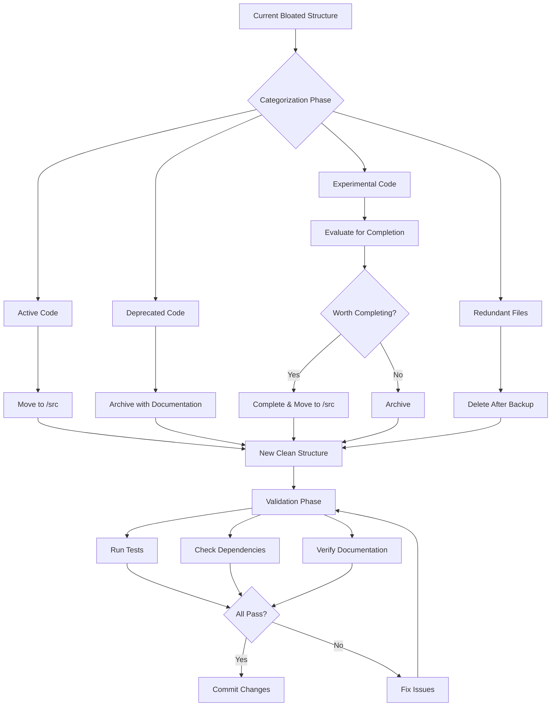
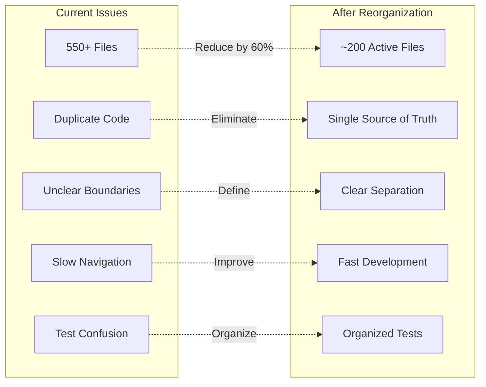
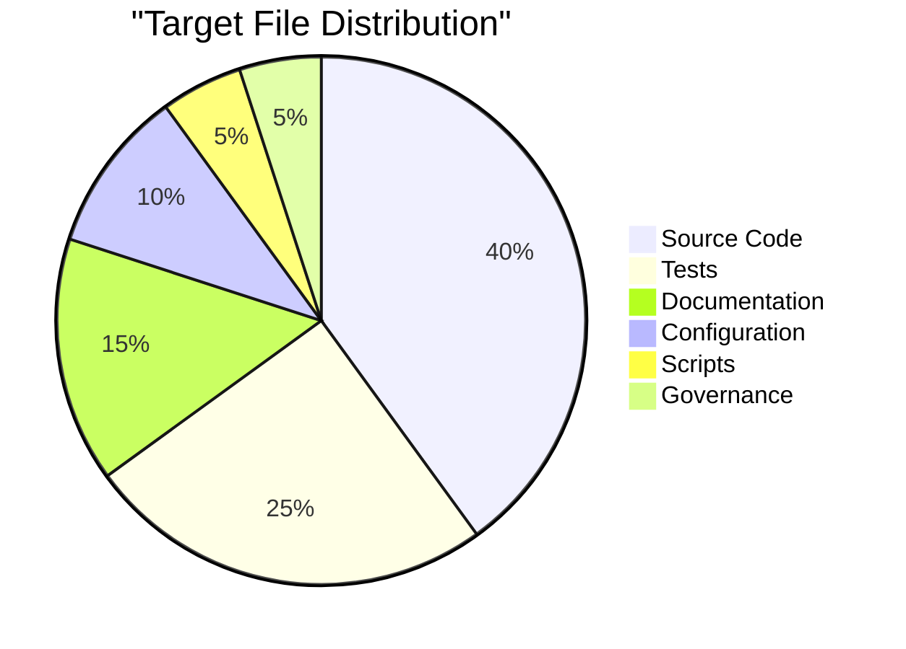

# 🏛️ File System Reorganization Round Table Discussion

**Date**: 2025-09-02  
**Participants**: Alex Novak (Frontend/Integration), Dr. Sarah Chen (Backend/Systems)  
**Facilitator**: Steven Holden  
**Purpose**: Address system bloat and establish clean, maintainable architecture

---

## 📊 Current State Analysis

### Alex Novak (Frontend Perspective)
"We have significant redundancy in our frontend structure. Multiple deprecated components, duplicate test files, and scattered documentation are making development difficult. The electron integration files are mixed with Angular components, creating confusion."

### Dr. Sarah Chen (Backend Perspective)
"The backend has accumulated technical debt with multiple API endpoint versions, unused database migrations, and experimental features that were never completed. Our Python modules lack clear boundaries, and configuration files are scattered across multiple directories."

---

## 🎯 Proposed Architecture

```
ClaudeResearchAndDevelopment/
│
├── 📁 src/                          # Active source code only
│   ├── 📁 backend/                  # Python FastAPI backend
│   │   ├── 📁 api/                  # API endpoints (single version)
│   │   ├── 📁 core/                 # Core business logic
│   │   ├── 📁 database/             # Database models & services
│   │   ├── 📁 services/             # External service integrations
│   │   └── 📁 utils/                # Shared utilities
│   │
│   ├── 📁 frontend/                 # Angular application
│   │   ├── 📁 app/                  # Angular app root
│   │   ├── 📁 components/           # Reusable components
│   │   ├── 📁 services/             # Angular services
│   │   ├── 📁 models/               # TypeScript interfaces
│   │   └── 📁 assets/               # Static assets
│   │
│   └── 📁 electron/                 # Electron main process
│       ├── 📁 main/                 # Main process code
│       ├── 📁 preload/              # Preload scripts
│       └── 📁 ipc/                  # IPC handlers
│
├── 📁 tests/                        # All test files
│   ├── 📁 backend/                  # Python tests
│   │   ├── 📁 unit/                 # Unit tests
│   │   ├── 📁 integration/          # Integration tests
│   │   └── 📁 fixtures/             # Test fixtures
│   │
│   ├── 📁 frontend/                 # Angular/TypeScript tests
│   │   ├── 📁 unit/                 # Component/service tests
│   │   ├── 📁 integration/          # Integration tests
│   │   └── 📁 e2e/                  # End-to-end tests
│   │
│   └── 📁 electron/                 # Electron-specific tests
│
├── 📁 docs/                         # Active documentation only
│   ├── 📁 architecture/             # Architecture decisions
│   ├── 📁 api/                      # API documentation
│   ├── 📁 guides/                   # User/developer guides
│   └── README.md                    # Main documentation entry
│
├── 📁 config/                       # All configuration files
│   ├── 📁 development/              # Dev environment configs
│   ├── 📁 production/               # Prod environment configs
│   └── 📁 testing/                  # Test environment configs
│
├── 📁 scripts/                      # Build and utility scripts
│   ├── 📁 build/                    # Build scripts
│   ├── 📁 deploy/                   # Deployment scripts
│   └── 📁 maintenance/              # Cleanup/maintenance scripts
│
├── 📁 .governance/                  # Governance system (unchanged)
│   ├── 📁 audit/                    # Audit logs
│   ├── 📁 session/                  # Session management
│   └── 📁 definitions/              # Rule definitions
│
└── 📁 .archive/                     # Archived/deprecated code
    ├── 📁 2025-09-02-cleanup/       # Today's cleanup archive
    │   ├── 📁 deprecated-components/ # Old UI components
    │   ├── 📁 legacy-api/           # Old API versions
    │   ├── 📁 experimental/         # Unfinished features
    │   ├── 📁 old-docs/             # Outdated documentation
    │   └── ARCHIVE_MANIFEST.md      # What and why archived
    │
    └── 📁 previous-archives/        # Historical archives

```

---

## 🔄 Migration Strategy Diagram



---

## 💬 Round Table Discussion

### Alex Novak's Proposal
"I propose we start with the frontend cleanup. We should:
1. Consolidate all Angular components into a single components directory
2. Remove the 'ai-assistant' wrapper directory - it adds no value
3. Separate Electron code completely from Angular code
4. Archive all the unused UI experiments from the past months"

### Dr. Sarah Chen's Proposal
"For the backend, I recommend:
1. Merge all API endpoint files into a single, versioned API structure
2. Extract database logic into a dedicated service layer
3. Remove the multiple config.py files and centralize configuration
4. Archive the experimental AI features that were never integrated"

### Steven Holden's Requirements
"As the system owner, I need:
1. Zero functionality loss during migration
2. Complete audit trail of what was archived and why
3. Ability to restore archived code if needed
4. Clear documentation of the new structure"

---

## 📈 Benefits Analysis



---

## 🚀 Implementation Phases

### Phase 1: Analysis & Categorization (Day 1)
- **Alex**: Catalog all frontend files, identify duplicates
- **Sarah**: Analyze backend modules, identify deprecated code
- **Both**: Create comprehensive inventory spreadsheet

### Phase 2: Archive Preparation (Day 2)
- Create archive structure with dated folders
- Document why each item is being archived
- Create restore procedures for emergency access

### Phase 3: File Migration (Day 3-4)
- Move active code to new structure
- Update all import paths
- Fix configuration references
- Update build scripts

### Phase 4: Validation (Day 5)
- Run complete test suite
- Verify all functionality
- Update documentation
- Performance benchmarking

### Phase 5: Cleanup (Day 6)
- Remove temporary migration files
- Optimize folder structure
- Create maintenance scripts
- Final documentation update

---

## 🎯 Decision Points

### Agreed Upon
✅ Separate src/ for active code only  
✅ Centralized test directory  
✅ Archive rather than delete  
✅ Timestamped archive folders  
✅ Mandatory archive documentation  

### Under Discussion
🤔 Should we keep AI experimental features?  
🤔 How many API versions to maintain?  
🤔 Electron as separate repository?  
🤔 Documentation versioning strategy?  

### Rejected
❌ Complete rewrite (too risky)  
❌ Microservices split (premature)  
❌ Monorepo tools (unnecessary complexity)  

---

## 📊 Metrics for Success



### Success Criteria
- [ ] 60% reduction in total file count
- [ ] 100% test passage after migration
- [ ] 0% functionality loss
- [ ] 50% faster build times
- [ ] 75% faster file navigation
- [ ] 100% documentation coverage for new structure

---

## 🔍 Risk Assessment

### High Risk
- **Import Path Breakage**: Mitigated by automated refactoring tools
- **Lost Functionality**: Mitigated by comprehensive testing
- **Configuration Errors**: Mitigated by staged migration

### Medium Risk
- **Team Confusion**: Mitigated by clear documentation
- **Build Script Issues**: Mitigated by incremental updates
- **Git History Loss**: Mitigated by preserving file moves

### Low Risk
- **Archive Access**: Clear restore procedures
- **Documentation Gaps**: Continuous updates
- **Performance Issues**: Benchmarking at each phase

---

## 📝 Action Items

### Immediate (Today)
1. **Alex**: Create frontend file inventory
2. **Sarah**: Create backend file inventory
3. **Both**: Review and approve structure

### Tomorrow
1. Set up archive directory structure
2. Create migration scripts
3. Begin Phase 1 categorization

### This Week
1. Complete full migration
2. Validate all functionality
3. Update all documentation
4. Archive deprecated code

---

## 🎓 Lessons from Discussion

### Alex's Insights
"The current structure grew organically without planning. We need strict boundaries between layers and clear ownership of each module."

### Sarah's Insights
"Our backend accumulated features without removing old ones. We must adopt a 'one in, one out' policy for experimental features."

### Consensus Points
1. **Clarity over Convenience**: Better to have longer paths than ambiguous locations
2. **Archive over Delete**: Keep history but out of active development
3. **Test Proximity**: Tests should mirror source structure exactly
4. **Documentation as Code**: Docs live with the code they document

---

## 📋 Final Recommendations

### The Path Forward
1. **Approve this structure** by end of day
2. **Begin migration** tomorrow morning
3. **Complete by end of week**
4. **Review and adjust** next week

### Long-term Maintenance
- Monthly archive reviews
- Quarterly structure assessments
- Automated bloat detection scripts
- Strict PR reviews for new directories

---

**Meeting Conclusion**: Both architects agree on the proposed structure with minor adjustments to be made during implementation. The cleanup will proceed in phases to minimize risk and ensure continuity of service.

*"A clean codebase is a productive codebase"* - Alex Novak  
*"Structure defines function"* - Dr. Sarah Chen