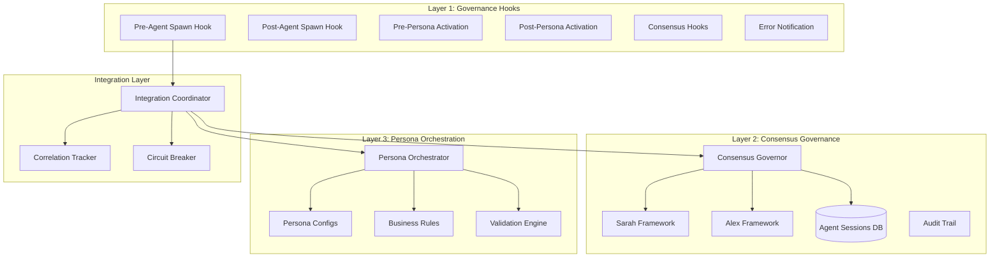
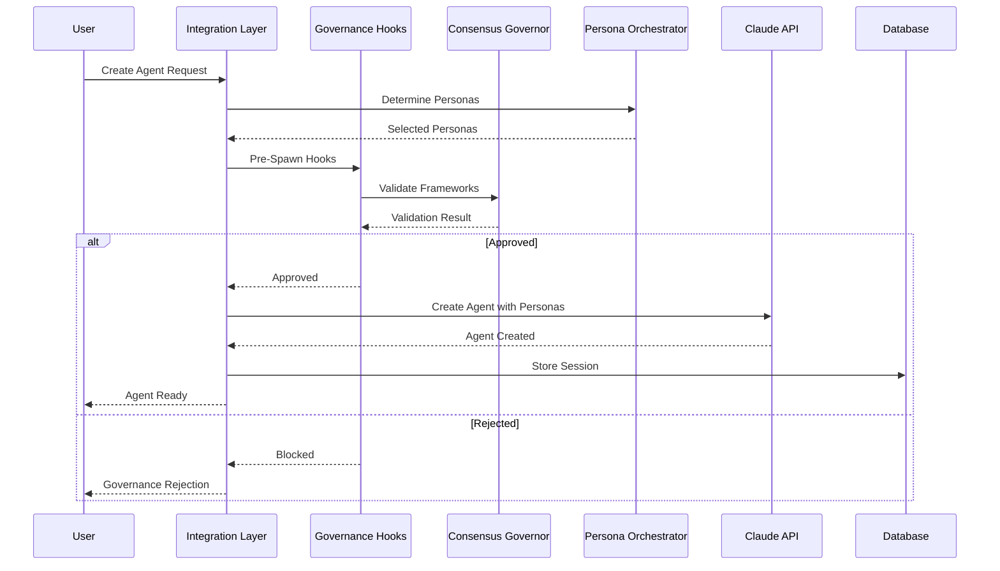

# AI Governance System Architecture

**Version**: 1.0  
**Date**: 2025-01-27  
**Author**: Dr. Avery Chen v1.0 with Morgan Hayes v2.0  
**Reviewers**: Alex Novak v3.0, Dr. Sarah Chen v1.2  
**Status**: Approved  
**Purpose**: Define AI agent governance system with validation and persona orchestration  
**Audience**: AI/ML team, Backend team, Security team  

---

## Overview

The AI Governance System provides comprehensive lifecycle management for AI agents with validation hooks, persona orchestration, and dual-framework governance. This prevents ungoverned AI operations while ensuring proper expertise allocation and cost control.

## Component Design

### Three-Layer Governance Architecture



### Core Components

#### 1. AI Governance Hooks
```python
class AIAgentHookManager:
    """Lifecycle hook management for AI agents"""
    
    def __init__(self):
        self.hooks: Dict[HookType, List[Callable]] = defaultdict(list)
        self.active_sessions: Dict[str, HookContext] = {}
        self.metrics = HookMetrics()
        
    async def spawn_agent_with_governance(self, config: AgentConfig) -> Agent:
        """Create agent with full governance"""
        context = HookContext(
            hook_type=HookType.PRE_AGENT_SPAWN,
            agent_id=generate_agent_id(),
            operation="spawn",
            payload=config.dict(),
            session_id=generate_session_id()
        )
        
        # Pre-spawn validation
        for hook in self.hooks[HookType.PRE_AGENT_SPAWN]:
            result = await hook(context)
            if result['action'] == 'block':
                raise GovernanceError(f"Blocked: {result['reason']}")
                
        # Token cost validation (Dr. Chen's requirement)
        await self._validate_token_cost(context)
        
        # Create agent
        agent = await self._create_agent(config)
        
        # Post-spawn hooks
        context.hook_type = HookType.POST_AGENT_SPAWN
        for hook in self.hooks[HookType.POST_AGENT_SPAWN]:
            await hook(context)
            
        return agent
```

#### 2. Consensus Governance System
```python
class PersonaGovernanceOrchestrator:
    """Database-backed governance with dual validation"""
    
    async def validate_with_frameworks(self, operation: str, context: Dict) -> Dict:
        """Apply both Sarah and Alex frameworks"""
        
        # Sarah's Three Questions
        sarah_result = await self.apply_sarah_framework(operation, context)
        
        # Alex's 3 AM Test
        alex_result = await self.apply_alex_framework(operation, context)
        
        # Both must approve
        approved = sarah_result['approved'] and alex_result['approved']
        
        # Store decision
        await self._store_governance_decision(
            operation=operation,
            context=context,
            sarah_result=sarah_result,
            alex_result=alex_result,
            approved=approved
        )
        
        return {
            'approved': approved,
            'sarah': sarah_result,
            'alex': alex_result,
            'timestamp': datetime.utcnow()
        }
```

#### 3. Persona Orchestrator
```python
class EnhancedPersonaOrchestrator:
    """Persona selection and validation enforcement"""
    
    def __init__(self):
        self.config_manager = PersonaConfigManager()
        self.validation_engine = ValidationEnforcementEngine()
        self.business_rules = BusinessRulesEngine()
        
    def pre_claude_hook(self, user_input: str, context: Dict = None) -> Dict:
        """Enhance prompt with persona expertise"""
        
        # Determine required personas
        personas = self._determine_required_personas(user_input, context)
        
        # Validate through 4-gate system
        validation_result = self.validation_engine.enforce_validation_pipeline(
            input_data=user_input,
            schema=self._get_schema(),
            persona_context=personas,
            enforcement_level="STRICT"
        )
        
        if not validation_result.passed:
            raise ValidationError(validation_result.errors)
            
        # Build enhanced prompt
        enhanced_prompt = self._build_enhanced_prompt(user_input, personas)
        
        return {
            'enhanced_prompt': enhanced_prompt,
            'personas': personas,
            'validation': validation_result
        }
```

## Data Flow

### Agent Creation Flow with Governance


## Security Boundaries

### Validation Enforcement
```python
# Four-gate validation that cannot be bypassed
class ValidationEnforcementEngine:
    def enforce_validation_pipeline(self, input_data, schema, persona_context, enforcement_level):
        # GATE 1: Schema Validation
        if not self._validate_schema(input_data, schema):
            return ValidationResult.SCHEMA_INVALID
            
        # GATE 2: Business Logic
        if not self._validate_business_logic(input_data, persona_context):
            return ValidationResult.BUSINESS_RULE_VIOLATION
            
        # GATE 3: Persona Rules
        if not self._validate_persona_rules(input_data, persona_context):
            return ValidationResult.PERSONA_RULE_VIOLATION
            
        # GATE 4: Bypass Detection
        if self._detect_bypass_attempt(input_data):
            self._log_security_event("BYPASS_ATTEMPT", input_data)
            return ValidationResult.BYPASS_ATTEMPTED
            
        return ValidationResult.VALID
```

### Token Cost Control (Dr. Chen's Framework)
```python
async def token_cost_validation_hook(context: HookContext):
    """Prevent token burn scenarios"""
    
    # Estimate token usage
    estimated_tokens = estimate_token_usage(context.payload)
    estimated_cost = estimated_tokens * CLAUDE_TOKEN_COST
    
    # Check limits
    if estimated_cost > MAX_COST_PER_REQUEST:
        return {
            'action': 'block',
            'reason': f'Estimated cost ${estimated_cost} exceeds limit'
        }
    
    # Check session cumulative cost
    session_cost = await get_session_cost(context.session_id)
    if session_cost + estimated_cost > MAX_SESSION_COST:
        return {
            'action': 'fallback',
            'alternative': 'use_cached_response',
            'reason': 'Session cost limit approaching'
        }
    
    return {'action': 'proceed', 'estimated_cost': estimated_cost}
```

## Failure Modes

### What Breaks First? (Sarah's Analysis)
1. **AI Service Unavailability**
   - **Detection**: Health checks, timeout monitoring
   - **Plan B**: Cached responses, non-AI fallback

2. **Token Cost Explosion**
   - **Detection**: Real-time cost monitoring
   - **Plan B**: Circuit breaker, request throttling

3. **Validation Conflicts**
   - **Detection**: Framework disagreement tracking
   - **Plan B**: Conservative approval (both must agree)

### 3 AM Debugging (Alex's Requirements)
- **Correlation Tracking**: Every request has correlation ID
- **Debug Trace**: Step-by-step operation logging
- **State Recovery**: Database-backed session recovery
- **Integration Points**: Clear boundaries between systems

## Integration Points

### Claude API Integration
```python
class ClaudeAPIClient:
    """Governed Claude API client"""
    
    async def invoke_with_governance(self, prompt: str, context: Dict) -> str:
        # Get governance approval
        governance_result = await self.governance.validate(prompt, context)
        if not governance_result['approved']:
            raise GovernanceError("Request blocked by governance")
            
        # Enhance with personas
        enhanced = await self.persona_orchestrator.enhance(prompt, context)
        
        # Make API call with monitoring
        response = await self._call_claude_api(
            prompt=enhanced['prompt'],
            max_tokens=enhanced.get('max_tokens', 1000),
            temperature=enhanced.get('temperature', 0.7)
        )
        
        # Validate response quality
        quality = await self._validate_response_quality(response)
        if quality['score'] < 0.7:
            logger.warning(f"Low quality response: {quality}")
            
        return response
```

### Database Schema
```sql
-- Agent sessions table
CREATE TABLE agent_sessions (
    session_id UUID PRIMARY KEY,
    agent_id VARCHAR(255) NOT NULL,
    status VARCHAR(50) NOT NULL,
    personas JSONB,
    governance_state JSONB,
    created_at TIMESTAMP DEFAULT NOW(),
    updated_at TIMESTAMP DEFAULT NOW()
);

-- Governance events table
CREATE TABLE governance_events (
    event_id UUID PRIMARY KEY,
    session_id UUID REFERENCES agent_sessions(session_id),
    event_type VARCHAR(100) NOT NULL,
    framework VARCHAR(50),
    approved BOOLEAN,
    details JSONB,
    created_at TIMESTAMP DEFAULT NOW()
);

-- Create indexes
CREATE INDEX idx_sessions_agent ON agent_sessions(agent_id);
CREATE INDEX idx_sessions_status ON agent_sessions(status);
CREATE INDEX idx_events_session ON governance_events(session_id);
```

## Performance Considerations

### Resource Limits
- Maximum 100 concurrent agent sessions
- Hook execution timeout: 5 seconds
- Validation pipeline timeout: 10 seconds
- Database query timeout: 2 seconds

### Optimization Strategies
- Persona configuration caching
- Validation result caching (5 minute TTL)
- Connection pooling for database
- Async/await throughout

## Compliance Considerations

### Audit Requirements
- All governance decisions logged
- Immutable audit trail
- 7-year retention policy
- Encrypted at rest

### Security Standards
- No bypass mechanisms in production
- All validations mandatory
- Security events tracked
- Regular security audits

## Monitoring & Observability

### Key Metrics
```python
governance_metrics = {
    'total_agent_requests': Counter('governance_agent_requests_total'),
    'governance_rejections': Counter('governance_rejections_total'),
    'validation_failures': Counter('validation_failures_total'),
    'token_cost': Histogram('token_cost_dollars'),
    'hook_execution_time': Histogram('hook_execution_seconds'),
    'persona_activation_success': Gauge('persona_activation_success_rate'),
    'circuit_breaker_state': Gauge('circuit_breaker_state')
}
```

### Alerting Thresholds
- Governance rejection rate > 10%: Warning
- Token cost > $100/hour: Critical
- Circuit breaker open: Critical
- Validation bypass detected: Security Alert

---

**Next Review**: February 27, 2025  
**Dependencies**: Claude API configuration, Persona configurations  
**Related**: [`persona-configurations.md`](../governance/persona-configurations.md), [`validation-rules.md`](../governance/validation-rules.md)