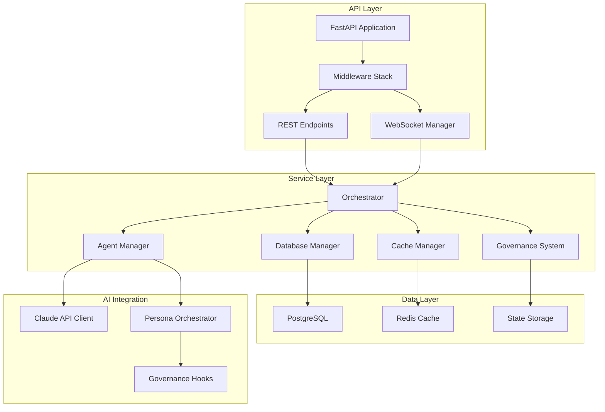
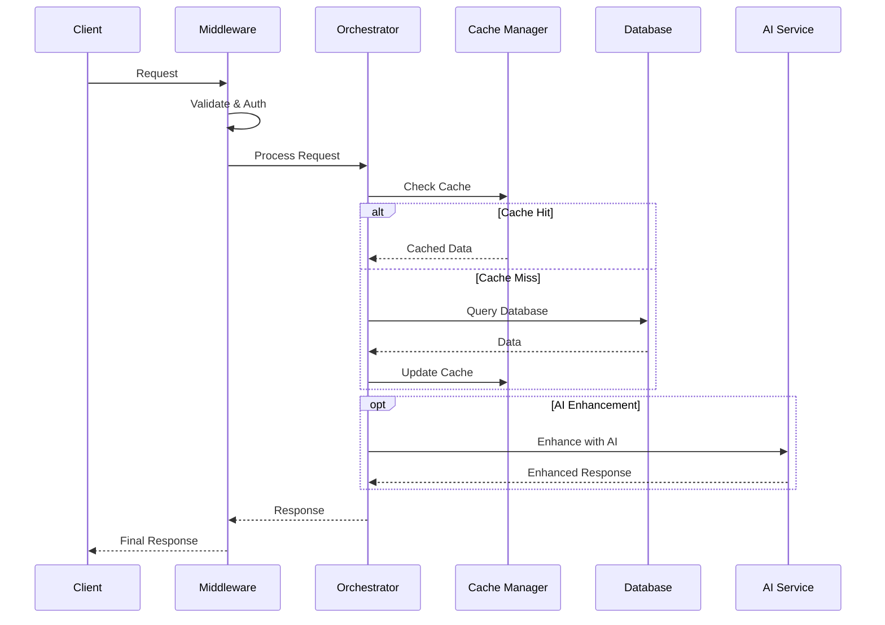

# Backend Architecture

**Version**: 1.0  
**Date**: 2025-01-27  
**Author**: Dr. Sarah Chen v1.2  
**Reviewers**: Alex Novak v3.0, Jordan Lee v3.2  
**Status**: Draft  
**Purpose**: Define Python/FastAPI backend architecture with resilience patterns  
**Audience**: Backend development team  

---

## Overview

The backend implements a FastAPI-based system with defensive programming patterns learned from production failures. Every service assumes failure modes and implements circuit breakers, fallbacks, and comprehensive monitoring.

## Component Design

### System Architecture



### Core Components

#### 1. Cache Manager (Critical - C2)
```python
class ResilientCacheManager:
    """Two-tier cache with failure resilience"""
    
    def __init__(self):
        self.hot_cache = {}  # In-memory, 100MB limit
        self.warm_cache = {}  # Disk-backed, 500MB limit
        self.circuit_breaker = CircuitBreaker()
        self.metrics = CacheMetrics()
        
    async def get_with_fallback(self, key: str) -> Optional[Any]:
        """Get with multiple fallback layers"""
        # Try hot cache
        if value := self.hot_cache.get(key):
            self.metrics.record_hit('hot')
            return value
            
        # Try warm cache with circuit breaker
        if self.circuit_breaker.is_closed():
            try:
                if value := await self._get_from_warm(key):
                    self.metrics.record_hit('warm')
                    return value
            except DiskIOError as e:
                self.circuit_breaker.record_failure()
                logger.error(f"Cache disk failure: {e}")
                
        # Fallback to database
        return await self._fetch_from_source(key)
```

#### 2. WebSocket Manager (High - H1)
```python
class WebSocketManager:
    """WebSocket with resource limits and cascade prevention"""
    
    MAX_CONNECTIONS = 10000
    MAX_PER_CLIENT = 5
    
    def __init__(self):
        self.connections: Dict[str, WebSocketConnection] = {}
        self.rate_limiter = RateLimiter()
        self.backpressure_monitor = BackpressureMonitor()
        
    async def handle_connection(self, websocket: WebSocket):
        """Handle with resource protection"""
        # Check limits
        if len(self.connections) >= self.MAX_CONNECTIONS:
            await websocket.close(code=1013, reason="At capacity")
            return
            
        # Check rate limits
        if not self.rate_limiter.allow(websocket.client):
            await websocket.close(code=1008, reason="Rate limited")
            return
            
        # Monitor backpressure
        if self.backpressure_monitor.is_degraded():
            await self._switch_to_polling_mode(websocket)
```

#### 3. Database Manager (High - H3)
```python
class DatabaseManager:
    """Database with initialization sequencing"""
    
    async def initialize_with_verification(self):
        """Prevent race conditions during startup"""
        # Phase 1: Create pool gradually
        self.pool = await self._create_pool_gradually()
        
        # Phase 2: Verify connectivity
        await self._verify_connectivity()
        
        # Phase 3: Warm up connections
        await self._warm_up_pool()
        
        # Phase 4: Update statistics
        await self._update_statistics()
        
        # Only now mark as ready
        self.ready = True
```

## Data Flow

### Request Processing Flow


## Security Boundaries

### API Security
- JWT authentication with refresh tokens
- Rate limiting per endpoint
- Input validation with Pydantic
- SQL injection prevention
- CORS configuration

### Service Isolation
```python
# Service boundaries with dependency injection
class ServiceContainer:
    def __init__(self):
        self.cache = CacheManager()
        self.db = DatabaseManager()
        self.ai = AIServiceClient()
        
    def get_isolated_service(self, service_type: str):
        """Get service with isolation"""
        if service_type == "cache":
            return IsolatedService(self.cache, readonly=True)
        # ... other services
```

## Failure Modes

### What Breaks First? (My Framework)
1. **External Dependencies**: Database, Redis, AI services
   - **Detection**: Health checks, circuit breakers
   - **Plan B**: Fallbacks, degraded mode, caching

2. **Resource Exhaustion**: Memory, connections, CPU
   - **Detection**: Metrics monitoring, alerts
   - **Plan B**: Rate limiting, backpressure, scaling

3. **Data Corruption**: Cache inconsistency, state drift
   - **Detection**: Checksums, validation
   - **Plan B**: Cache invalidation, state recovery

### Defensive Patterns
```python
# Circuit breaker for external services
circuit_breaker = CircuitBreaker(
    failure_threshold=5,
    recovery_timeout=60,
    expected_exception=ExternalServiceError
)

# Fallback chain
fallback_chain = FallbackChain([
    cache_lookup,
    database_query,
    default_response
])

# Timeout decorator
@timeout(seconds=5)
async def external_api_call():
    pass
```

## Integration Points

### Frontend Integration
- REST API: OpenAPI 3.0 specification
- WebSocket: Real-time event streaming
- Health endpoints: /health, /ready
- Metrics: Prometheus format

### AI Service Integration
- Claude API client with retry logic
- Token counting and cost tracking
- Response caching
- Fallback to non-AI responses

### Database Integration
- PostgreSQL with asyncpg
- Connection pooling (min: 5, max: 20)
- Read replicas for scaling
- Transaction management

## Performance Considerations

### Resource Limits
- Memory: 2GB per process
- CPU: 2 cores per process
- Database connections: 20 max
- Cache size: 600MB total

### Optimization Strategies
- Query optimization with EXPLAIN ANALYZE
- Index strategy documented
- Caching strategy with TTL
- Async/await throughout

## Compliance Considerations

### Data Protection
- PII encryption at rest
- Audit logging for all operations
- Data retention policies
- GDPR compliance

### Security Standards
- OWASP Top 10 prevention
- Regular dependency updates
- Security scanning in CI/CD
- Penetration testing quarterly

## Monitoring & Observability

### Metrics Collected
```python
metrics = {
    'api_request_duration': Histogram,
    'cache_hit_rate': Gauge,
    'websocket_connections': Gauge,
    'database_pool_size': Gauge,
    'ai_token_usage': Counter,
    'error_rate': Counter
}
```

### Logging Strategy
- Structured JSON logging
- Correlation ID tracking
- Log levels: DEBUG, INFO, WARNING, ERROR, CRITICAL
- Centralized log aggregation

### Alerting Thresholds
- Error rate > 1% (Warning)
- Response time > 2s (Warning)
- Cache hit rate < 80% (Info)
- Database connections > 80% (Critical)

---

**Next Review**: February 27, 2025  
**Dependencies**: Database schema, AI service contracts  
**Related**: [`api-contracts.md`](../data-flow/api-contracts.md), [`database-schema.md`](./database-schema.md)