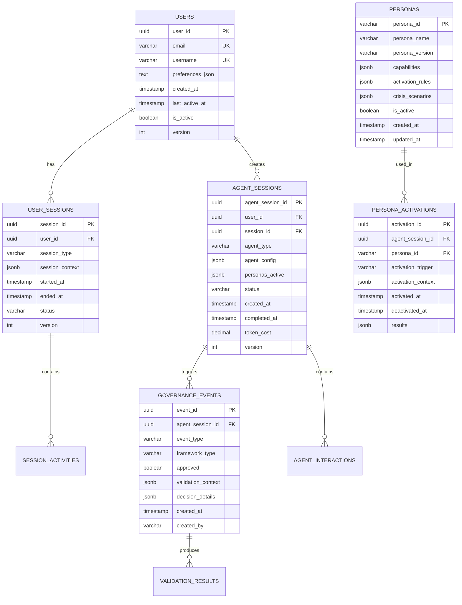

# Database Schema & Data Architecture

**Version**: 1.0  
**Date**: 2025-01-27  
**Author**: Dr. Jamie Rodriguez v3.2  
**Reviewers**: Dr. Sarah Chen v1.2, Quinn Roberts v1.1  
**Status**: Draft  
**Purpose**: Define database schema, data models, and persistence strategy  
**Audience**: Backend team, DevOps team, Data team  

---

## Overview

The AI Development Assistant uses PostgreSQL as the primary database with Redis for caching. The schema supports AI agent lifecycle management, governance tracking, user sessions, and audit requirements. All designs follow ACID principles with optimistic locking for performance.

## Database Architecture



## Core Tables

### Users Table
```sql
-- User management with preferences and activity tracking
CREATE TABLE users (
    user_id UUID PRIMARY KEY DEFAULT gen_random_uuid(),
    email VARCHAR(255) NOT NULL UNIQUE,
    username VARCHAR(100) NOT NULL UNIQUE,
    full_name VARCHAR(255),
    preferences_json JSONB DEFAULT '{}',
    auth_provider VARCHAR(50) DEFAULT 'local',
    auth_external_id VARCHAR(255),
    created_at TIMESTAMP WITH TIME ZONE DEFAULT NOW(),
    last_active_at TIMESTAMP WITH TIME ZONE DEFAULT NOW(),
    is_active BOOLEAN DEFAULT true,
    version INTEGER DEFAULT 1,
    
    CONSTRAINT users_email_format CHECK (email ~* '^[A-Za-z0-9._%+-]+@[A-Za-z0-9.-]+\.[A-Za-z]{2,}$')
);

-- Indexes for performance
CREATE INDEX idx_users_email ON users(email);
CREATE INDEX idx_users_username ON users(username);
CREATE INDEX idx_users_active ON users(is_active, last_active_at);
CREATE INDEX idx_users_auth_external ON users(auth_provider, auth_external_id);
```

### Agent Sessions Table
```sql
-- AI agent lifecycle tracking with governance state
CREATE TABLE agent_sessions (
    agent_session_id UUID PRIMARY KEY DEFAULT gen_random_uuid(),
    user_id UUID NOT NULL REFERENCES users(user_id),
    session_id UUID REFERENCES user_sessions(session_id),
    agent_type VARCHAR(100) NOT NULL,
    agent_config JSONB DEFAULT '{}',
    personas_active JSONB DEFAULT '[]',
    governance_state JSONB DEFAULT '{}',
    status VARCHAR(50) DEFAULT 'initializing',
    created_at TIMESTAMP WITH TIME ZONE DEFAULT NOW(),
    started_at TIMESTAMP WITH TIME ZONE,
    completed_at TIMESTAMP WITH TIME ZONE,
    error_details JSONB,
    token_cost DECIMAL(10,4) DEFAULT 0.0000,
    estimated_cost DECIMAL(10,4),
    max_cost_limit DECIMAL(10,4),
    version INTEGER DEFAULT 1,
    
    CONSTRAINT agent_sessions_status_valid CHECK (
        status IN ('initializing', 'pending_approval', 'approved', 'running', 
                  'completed', 'failed', 'cancelled', 'blocked')
    ),
    CONSTRAINT agent_sessions_cost_valid CHECK (token_cost >= 0 AND estimated_cost >= 0)
);

-- Indexes for agent session queries
CREATE INDEX idx_agent_sessions_user ON agent_sessions(user_id);
CREATE INDEX idx_agent_sessions_status ON agent_sessions(status);
CREATE INDEX idx_agent_sessions_created ON agent_sessions(created_at);
CREATE INDEX idx_agent_sessions_type ON agent_sessions(agent_type);
CREATE INDEX idx_agent_sessions_cost ON agent_sessions(token_cost);

-- Partial index for active sessions
CREATE INDEX idx_agent_sessions_active ON agent_sessions(created_at, status) 
    WHERE status IN ('running', 'pending_approval', 'approved');
```

### Governance Events Table
```sql
-- Governance decision tracking for audit and compliance
CREATE TABLE governance_events (
    event_id UUID PRIMARY KEY DEFAULT gen_random_uuid(),
    agent_session_id UUID NOT NULL REFERENCES agent_sessions(agent_session_id),
    event_type VARCHAR(100) NOT NULL,
    framework_type VARCHAR(50) NOT NULL,
    approved BOOLEAN NOT NULL,
    validation_context JSONB DEFAULT '{}',
    decision_details JSONB DEFAULT '{}',
    decision_reason TEXT,
    fallback_triggered BOOLEAN DEFAULT false,
    created_at TIMESTAMP WITH TIME ZONE DEFAULT NOW(),
    created_by VARCHAR(255),
    correlation_id UUID,
    
    CONSTRAINT governance_events_framework_valid CHECK (
        framework_type IN ('sarah_three_questions', 'alex_3am_test', 'consensus', 'emergency')
    ),
    CONSTRAINT governance_events_type_valid CHECK (
        event_type IN ('pre_agent_spawn', 'post_agent_spawn', 'pre_persona_activation',
                      'post_persona_activation', 'cost_validation', 'consensus_check',
                      'emergency_stop', 'circuit_breaker')
    )
);

-- Indexes for governance queries and audit
CREATE INDEX idx_governance_events_session ON governance_events(agent_session_id);
CREATE INDEX idx_governance_events_type ON governance_events(event_type);
CREATE INDEX idx_governance_events_framework ON governance_events(framework_type);
CREATE INDEX idx_governance_events_approved ON governance_events(approved);
CREATE INDEX idx_governance_events_created ON governance_events(created_at);
CREATE INDEX idx_governance_events_correlation ON governance_events(correlation_id);

-- Partial index for rejected decisions (compliance requirement)
CREATE INDEX idx_governance_events_rejected ON governance_events(created_at, decision_reason) 
    WHERE approved = false;
```

### Personas Table
```sql
-- Dynamic persona definitions and activation rules
CREATE TABLE personas (
    persona_id VARCHAR(100) PRIMARY KEY,
    persona_name VARCHAR(255) NOT NULL,
    persona_version VARCHAR(20) NOT NULL,
    specialization VARCHAR(255) NOT NULL,
    capabilities JSONB DEFAULT '{}',
    activation_rules JSONB DEFAULT '{}',
    crisis_scenarios JSONB DEFAULT '{}',
    behavioral_patterns JSONB DEFAULT '{}',
    is_active BOOLEAN DEFAULT true,
    is_core BOOLEAN DEFAULT false,
    priority_level INTEGER DEFAULT 5,
    created_at TIMESTAMP WITH TIME ZONE DEFAULT NOW(),
    updated_at TIMESTAMP WITH TIME ZONE DEFAULT NOW(),
    
    CONSTRAINT personas_priority_valid CHECK (priority_level BETWEEN 1 AND 10),
    UNIQUE(persona_name, persona_version)
);

-- Indexes for persona queries
CREATE INDEX idx_personas_active ON personas(is_active);
CREATE INDEX idx_personas_core ON personas(is_core);
CREATE INDEX idx_personas_priority ON personas(priority_level);
CREATE INDEX idx_personas_specialization ON personas(specialization);
```

## Data Integrity & Constraints

### Referential Integrity
```sql
-- Foreign key constraints with cascading rules
ALTER TABLE user_sessions 
    ADD CONSTRAINT fk_user_sessions_user 
    FOREIGN KEY (user_id) REFERENCES users(user_id) ON DELETE CASCADE;

ALTER TABLE agent_sessions 
    ADD CONSTRAINT fk_agent_sessions_user 
    FOREIGN KEY (user_id) REFERENCES users(user_id) ON DELETE CASCADE;

ALTER TABLE governance_events 
    ADD CONSTRAINT fk_governance_events_session 
    FOREIGN KEY (agent_session_id) REFERENCES agent_sessions(agent_session_id) ON DELETE CASCADE;
```

### Business Rule Constraints
```sql
-- Ensure governance approval before agent activation
CREATE OR REPLACE FUNCTION check_governance_approval()
RETURNS TRIGGER AS $$
BEGIN
    IF NEW.status = 'running' AND OLD.status != 'running' THEN
        IF NOT EXISTS (
            SELECT 1 FROM governance_events 
            WHERE agent_session_id = NEW.agent_session_id 
            AND approved = true 
            AND event_type IN ('pre_agent_spawn', 'consensus_check')
        ) THEN
            RAISE EXCEPTION 'Agent cannot start without governance approval';
        END IF;
    END IF;
    RETURN NEW;
END;
$$ LANGUAGE plpgsql;

CREATE TRIGGER trigger_check_governance_approval
    BEFORE UPDATE ON agent_sessions
    FOR EACH ROW EXECUTE FUNCTION check_governance_approval();
```

### Audit Trail Implementation
```sql
-- Immutable audit log for compliance (Quinn Roberts requirement)
CREATE TABLE audit_log (
    audit_id UUID PRIMARY KEY DEFAULT gen_random_uuid(),
    table_name VARCHAR(100) NOT NULL,
    record_id UUID NOT NULL,
    operation VARCHAR(10) NOT NULL,
    old_values JSONB,
    new_values JSONB,
    changed_by VARCHAR(255),
    changed_at TIMESTAMP WITH TIME ZONE DEFAULT NOW(),
    correlation_id UUID,
    
    CONSTRAINT audit_log_operation_valid CHECK (operation IN ('INSERT', 'UPDATE', 'DELETE'))
);

-- Audit trigger function
CREATE OR REPLACE FUNCTION audit_trigger_function()
RETURNS TRIGGER AS $$
BEGIN
    INSERT INTO audit_log (table_name, record_id, operation, old_values, new_values, changed_by, correlation_id)
    VALUES (
        TG_TABLE_NAME,
        COALESCE(NEW.user_id, NEW.agent_session_id, NEW.event_id),
        TG_OP,
        CASE WHEN TG_OP = 'DELETE' THEN row_to_json(OLD) ELSE NULL END,
        CASE WHEN TG_OP IN ('INSERT', 'UPDATE') THEN row_to_json(NEW) ELSE NULL END,
        current_setting('app.current_user', true),
        current_setting('app.correlation_id', true)::UUID
    );
    RETURN COALESCE(NEW, OLD);
END;
$$ LANGUAGE plpgsql;

-- Apply audit triggers to critical tables
CREATE TRIGGER audit_users AFTER INSERT OR UPDATE OR DELETE ON users
    FOR EACH ROW EXECUTE FUNCTION audit_trigger_function();
    
CREATE TRIGGER audit_agent_sessions AFTER INSERT OR UPDATE OR DELETE ON agent_sessions
    FOR EACH ROW EXECUTE FUNCTION audit_trigger_function();
    
CREATE TRIGGER audit_governance_events AFTER INSERT OR UPDATE OR DELETE ON governance_events
    FOR EACH ROW EXECUTE FUNCTION audit_trigger_function();
```

## Performance Optimization

### Partitioning Strategy
```sql
-- Partition governance_events by month for performance
CREATE TABLE governance_events_template (LIKE governance_events INCLUDING ALL);

-- Create monthly partitions
CREATE TABLE governance_events_2025_01 PARTITION OF governance_events_template
    FOR VALUES FROM ('2025-01-01') TO ('2025-02-01');

CREATE TABLE governance_events_2025_02 PARTITION OF governance_events_template
    FOR VALUES FROM ('2025-02-01') TO ('2025-03-01');

-- Automated partition maintenance
CREATE OR REPLACE FUNCTION create_monthly_partition(table_name text, start_date date)
RETURNS void AS $$
DECLARE
    partition_name text;
    end_date date;
BEGIN
    partition_name := table_name || '_' || to_char(start_date, 'YYYY_MM');
    end_date := start_date + interval '1 month';
    
    EXECUTE format('CREATE TABLE %I PARTITION OF %I FOR VALUES FROM (%L) TO (%L)',
                   partition_name, table_name, start_date, end_date);
END;
$$ LANGUAGE plpgsql;
```

### Query Optimization Views
```sql
-- Active agent sessions with governance status
CREATE VIEW active_agent_sessions AS
SELECT 
    a.agent_session_id,
    a.user_id,
    a.agent_type,
    a.status,
    a.token_cost,
    a.created_at,
    (SELECT COUNT(*) FROM governance_events g 
     WHERE g.agent_session_id = a.agent_session_id AND g.approved = true) as approvals,
    (SELECT COUNT(*) FROM governance_events g 
     WHERE g.agent_session_id = a.agent_session_id AND g.approved = false) as rejections
FROM agent_sessions a
WHERE a.status IN ('running', 'pending_approval', 'approved');

-- User activity summary for analytics
CREATE VIEW user_activity_summary AS
SELECT 
    u.user_id,
    u.username,
    u.last_active_at,
    COUNT(a.agent_session_id) as total_sessions,
    SUM(a.token_cost) as total_cost,
    AVG(a.token_cost) as avg_cost_per_session,
    MAX(a.created_at) as last_session_at
FROM users u
LEFT JOIN agent_sessions a ON u.user_id = a.user_id
WHERE u.is_active = true
GROUP BY u.user_id, u.username, u.last_active_at;
```

## Data Migration Strategy

### Version Control for Schema
```sql
-- Schema versioning table
CREATE TABLE schema_migrations (
    version INTEGER PRIMARY KEY,
    description VARCHAR(500) NOT NULL,
    applied_at TIMESTAMP WITH TIME ZONE DEFAULT NOW(),
    rollback_sql TEXT,
    checksum VARCHAR(64)
);

-- Example migration
INSERT INTO schema_migrations (version, description, rollback_sql) VALUES
(1, 'Initial schema creation', 'DROP SCHEMA IF EXISTS public CASCADE; CREATE SCHEMA public;'),
(2, 'Add governance events table', 'DROP TABLE governance_events CASCADE;'),
(3, 'Add personas table', 'DROP TABLE personas CASCADE;');
```

### Backup and Recovery
```sql
-- Automated backup views for critical data
CREATE VIEW backup_critical_data AS
SELECT 
    'users' as table_name, user_id::text as record_id, 
    row_to_json(users.*) as data, created_at as backup_priority
FROM users
UNION ALL
SELECT 
    'agent_sessions' as table_name, agent_session_id::text as record_id,
    row_to_json(agent_sessions.*) as data, created_at as backup_priority  
FROM agent_sessions
WHERE created_at > NOW() - INTERVAL '30 days'
UNION ALL
SELECT 
    'governance_events' as table_name, event_id::text as record_id,
    row_to_json(governance_events.*) as data, created_at as backup_priority
FROM governance_events
WHERE created_at > NOW() - INTERVAL '90 days';
```

## Security Implementation

### Row Level Security (RLS)
```sql
-- Enable RLS on sensitive tables
ALTER TABLE users ENABLE ROW LEVEL SECURITY;
ALTER TABLE agent_sessions ENABLE ROW LEVEL SECURITY;
ALTER TABLE governance_events ENABLE ROW LEVEL SECURITY;

-- User can only access their own data
CREATE POLICY user_isolation_policy ON users
    FOR ALL TO application_user
    USING (user_id = current_setting('app.current_user_id')::UUID);

CREATE POLICY agent_session_user_policy ON agent_sessions
    FOR ALL TO application_user
    USING (user_id = current_setting('app.current_user_id')::UUID);

-- Governance events readable by session owner
CREATE POLICY governance_events_policy ON governance_events
    FOR SELECT TO application_user
    USING (EXISTS (
        SELECT 1 FROM agent_sessions 
        WHERE agent_session_id = governance_events.agent_session_id
        AND user_id = current_setting('app.current_user_id')::UUID
    ));
```

### Data Encryption
```sql
-- Encrypted sensitive fields using pgcrypto
CREATE EXTENSION IF NOT EXISTS pgcrypto;

-- Function to encrypt sensitive data
CREATE OR REPLACE FUNCTION encrypt_sensitive(data text)
RETURNS bytea AS $$
BEGIN
    RETURN pgp_sym_encrypt(data, current_setting('app.encryption_key'));
END;
$$ LANGUAGE plpgsql SECURITY DEFINER;

-- Function to decrypt sensitive data
CREATE OR REPLACE FUNCTION decrypt_sensitive(encrypted_data bytea)
RETURNS text AS $$
BEGIN
    RETURN pgp_sym_decrypt(encrypted_data, current_setting('app.encryption_key'));
END;
$$ LANGUAGE plpgsql SECURITY DEFINER;
```

## Monitoring & Maintenance

### Health Check Functions
```sql
-- Database health monitoring
CREATE OR REPLACE FUNCTION db_health_check()
RETURNS TABLE (
    metric VARCHAR(50),
    value NUMERIC,
    status VARCHAR(20),
    threshold NUMERIC
) AS $$
BEGIN
    RETURN QUERY
    WITH health_metrics AS (
        SELECT 'active_connections' as metric, 
               COUNT(*)::NUMERIC as value, 
               100::NUMERIC as threshold
        FROM pg_stat_activity WHERE state = 'active'
        
        UNION ALL
        
        SELECT 'db_size_mb', 
               pg_database_size(current_database()) / 1024 / 1024, 
               10240 -- 10GB threshold
               
        UNION ALL
        
        SELECT 'cache_hit_ratio',
               CASE WHEN blks_read + blks_hit = 0 THEN 100
                    ELSE (blks_hit * 100.0 / (blks_hit + blks_read))
               END,
               90 -- 90% hit ratio threshold
        FROM pg_stat_database WHERE datname = current_database()
    )
    SELECT 
        h.metric,
        h.value,
        CASE WHEN h.value <= h.threshold THEN 'OK' ELSE 'WARNING' END,
        h.threshold
    FROM health_metrics h;
END;
$$ LANGUAGE plpgsql;
```

## Compliance & Retention

### Data Retention Policies
```sql
-- Automated data cleanup for compliance
CREATE OR REPLACE FUNCTION cleanup_old_data()
RETURNS void AS $$
BEGIN
    -- Archive old governance events (keep 7 years for audit)
    DELETE FROM governance_events 
    WHERE created_at < NOW() - INTERVAL '7 years';
    
    -- Archive old user sessions (keep 2 years)
    DELETE FROM user_sessions 
    WHERE ended_at < NOW() - INTERVAL '2 years';
    
    -- Archive completed agent sessions (keep 1 year)
    DELETE FROM agent_sessions 
    WHERE status = 'completed' 
    AND completed_at < NOW() - INTERVAL '1 year';
    
    -- Log cleanup operation
    INSERT INTO audit_log (table_name, record_id, operation, new_values)
    VALUES ('system', gen_random_uuid(), 'CLEANUP', 
            json_build_object('cleaned_at', NOW(), 'retention_policy', 'applied'));
END;
$$ LANGUAGE plpgsql;

-- Schedule monthly cleanup
SELECT cron.schedule('data_cleanup', '0 2 1 * *', 'SELECT cleanup_old_data();');
```

---

**Next Review**: February 27, 2025  
**Dependencies**: Backend implementation, cache configuration  
**Related**: [`backend-architecture.md`](./backend-architecture.md), [`ai-governance-architecture.md`](./ai-governance-architecture.md)