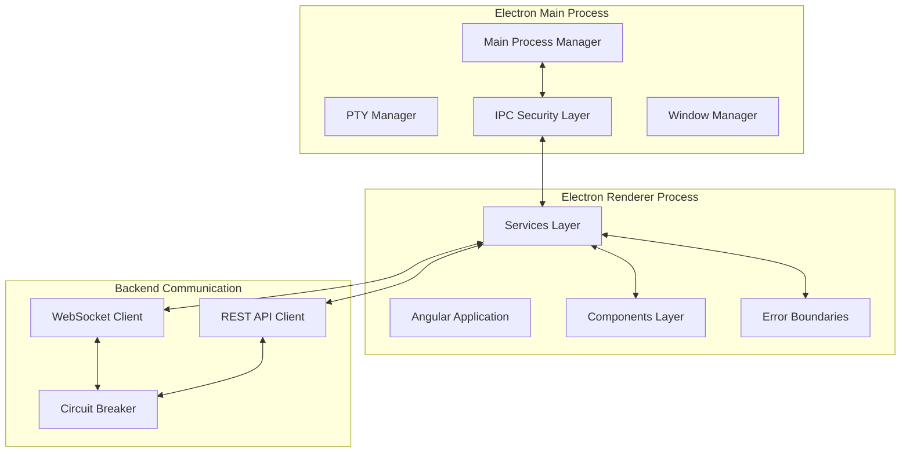
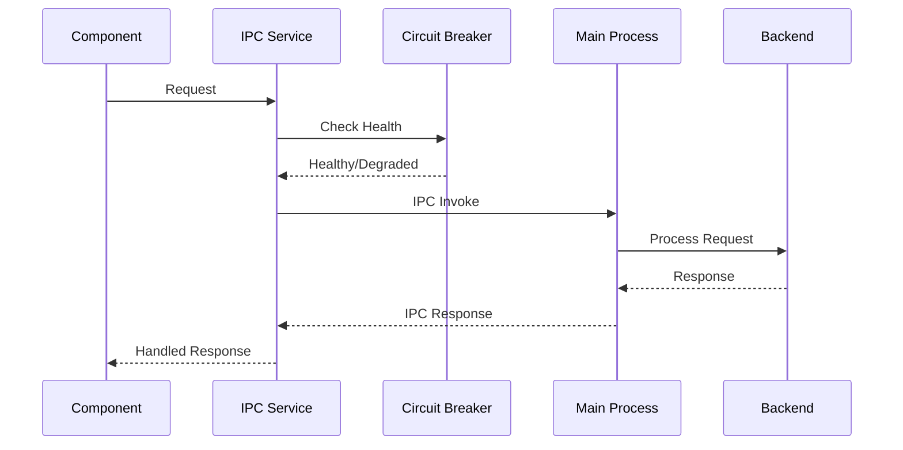

# Frontend Architecture

**Version**: 1.0  
**Date**: 2025-01-27  
**Author**: Alex Novak v3.0  
**Reviewers**: Dr. Sarah Chen v1.2, Maya Patel v3.0  
**Status**: Draft  
**Purpose**: Define Electron/Angular frontend architecture with defensive patterns  
**Audience**: Frontend development team  

---

## Overview

The frontend consists of an Electron desktop application with Angular framework, implementing defensive programming patterns learned from production incidents. Every component assumes failure and implements proper error boundaries, memory management, and IPC security.

## Component Design

### Architecture Layers



### Core Components

#### 1. IPC Service (Critical - H2)
```typescript
// Defensive IPC implementation preventing memory leaks
class SecureIpcService {
  private readonly circuitBreaker: CircuitBreaker;
  private readonly listeners: Map<string, Function> = new Map();
  private readonly maxListeners = 100; // Prevent leak
  
  constructor(private zone: NgZone) {
    this.circuitBreaker = new CircuitBreaker({
      threshold: 5,
      timeout: 30000,
      resetTimeout: 60000
    });
    this.setupCleanup();
  }
  
  private setupCleanup(): void {
    // Prevent memory leak (C1)
    window.addEventListener('beforeunload', () => {
      this.removeAllListeners();
    });
  }
}
```

#### 2. Terminal Service (Critical - C1)
- Manages PTY sessions with proper cleanup
- Prevents memory accumulation
- Implements session limits
- Provides fallback for PTY failures

#### 3. WebSocket Service
- Real-time communication with backend
- Automatic reconnection with exponential backoff
- Message queuing during disconnection
- Connection state management

## Data Flow

### IPC Communication Flow


### State Management
- NgRx for predictable state
- Immutable state updates
- State persistence with encryption
- State recovery on crash

## Security Boundaries

### IPC Security
- Context isolation enforced
- Preload script minimal API exposure
- Request/response validation
- Rate limiting per channel

### Content Security Policy
```typescript
const CSP = {
  'default-src': ["'self'"],
  'script-src': ["'self'"],
  'style-src': ["'self'", "'unsafe-inline'"],
  'img-src': ["'self'", "data:", "https:"],
  'connect-src': ["'self'", "ws://localhost:*", "http://localhost:*"]
};
```

## Failure Modes

### What Breaks First? (Sarah's Framework)
1. **IPC Communication**: Network issues, process crashes
   - **Detection**: Timeout monitoring, health checks
   - **Recovery**: Circuit breaker, fallback to cached data

2. **Memory Management**: Listener accumulation, large datasets
   - **Detection**: Memory monitoring, listener counting
   - **Recovery**: Automatic cleanup, pagination

3. **WebSocket Connection**: Network interruption, backend failure
   - **Detection**: Heartbeat mechanism, connection state
   - **Recovery**: Exponential backoff reconnection

### 3 AM Test (My Framework)
- **Debuggability**: Correlation IDs, comprehensive logging
- **Integration Points**: Documented IPC channels, API contracts
- **Cleanup**: Automatic listener removal, memory management

## Integration Points

### Backend Integration
- REST API: Port 8000 (FastAPI)
- WebSocket: Port 8000/ws
- Health Check: /health endpoint
- Metrics: /metrics endpoint

### Electron Main Process
- IPC Channels documented in `/docs/architecture/data-flow/ipc-communication.md`
- PTY integration for terminal functionality
- File system access with security restrictions

## Performance Considerations

### Memory Management
- Maximum 500MB renderer process memory
- Automatic garbage collection triggers
- Virtual scrolling for large datasets
- Lazy loading for components

### Rendering Performance
- 60fps target for animations
- OnPush change detection strategy
- Track by functions for lists
- Web workers for heavy computation

## Compliance Considerations

### GDPR Requirements
- No personal data in logs
- User consent for analytics
- Data deletion capabilities
- Export functionality

### Security Compliance
- Regular security updates
- Vulnerability scanning
- Penetration testing
- Security incident response

## Monitoring & Debugging

### Metrics Tracked
- Memory usage per process
- IPC message latency
- WebSocket connection status
- Error rates by component

### Debug Tools
- Chrome DevTools integration
- Custom performance profiler
- Memory leak detector
- IPC message inspector

---

**Next Review**: February 27, 2025  
**Dependencies**: Backend API specification, IPC channel definitions  
**Related**: [`ipc-communication.md`](../data-flow/ipc-communication.md), [`security-boundaries.md`](./security-boundaries.md)