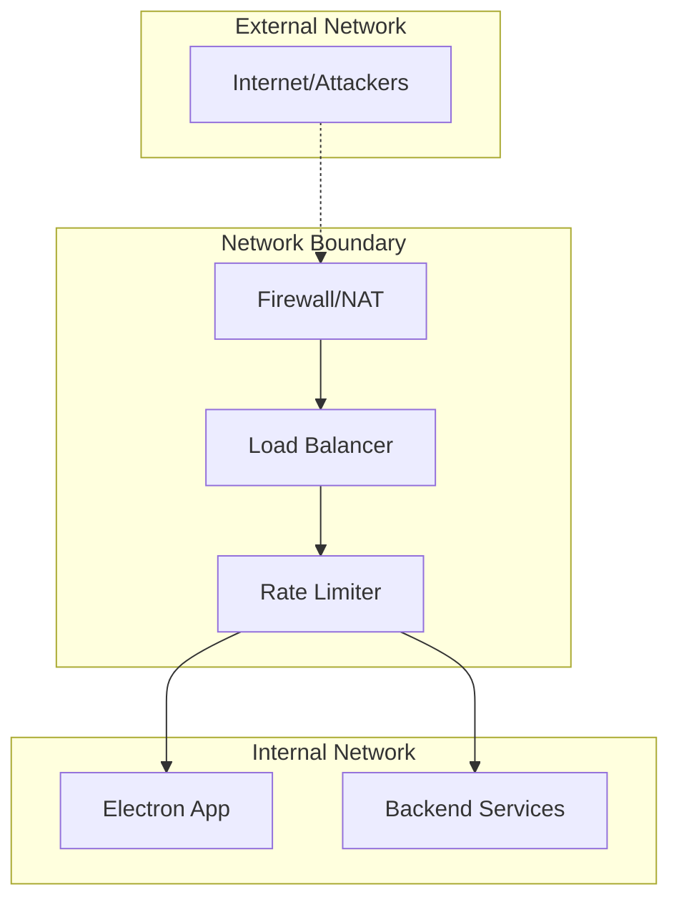

# Security Boundaries & Threat Model

**Version**: 1.0  
**Date**: 2025-01-27  
**Author**: Morgan Hayes v2.0  
**Reviewers**: Alex Novak v3.0, Quinn Roberts v1.1  
**Status**: Draft  
**Purpose**: Define security boundaries, threat model, and defensive controls  
**Audience**: Security team, Development team, DevOps team  

---

## Overview

The AI Development Assistant implements defense-in-depth security architecture with multiple boundary layers. Each boundary enforces specific controls and assumes compromise of adjacent layers. This document outlines the threat model, security boundaries, and defensive measures based on real-world attack patterns and security incidents.

## Threat Model

### Threat Actors
1. **External Attackers**: Remote exploitation, API abuse, injection attacks
2. **Malicious Users**: Account takeover, privilege escalation, data exfiltration
3. **Insider Threats**: Legitimate access abuse, data misuse, policy violations
4. **Supply Chain**: Compromised dependencies, malicious packages, backdoors

### Attack Vectors
1. **Application Layer**: SQL injection, XSS, CSRF, authentication bypass
2. **Network Layer**: Man-in-the-middle, DNS poisoning, traffic interception
3. **System Layer**: Privilege escalation, file system access, process manipulation
4. **Social Engineering**: Phishing, credential theft, business email compromise

### Crown Jewels (What We Protect)
1. **User Data**: Authentication credentials, personal preferences, session data
2. **AI Interactions**: Conversation history, agent configurations, prompt data
3. **System Secrets**: API keys, database credentials, encryption keys
4. **Business Logic**: Persona definitions, governance rules, proprietary algorithms

## Security Boundaries

### Boundary 1: Network Perimeter



**Controls Implemented:**
- **Network Firewall**: Block unauthorized ports, whitelist protocols
- **Rate Limiting**: Per-IP request limits, burst protection
- **SSL/TLS Termination**: Encrypt all traffic, certificate validation
- **DDoS Protection**: Traffic analysis, automatic blocking

**Security Assumptions:**
- Network traffic may be intercepted or modified
- Attackers will probe for open ports and services
- Rate limiting can be bypassed with distributed attacks

### Boundary 2: Application Authentication

```typescript
// Authentication boundary implementation
class AuthenticationBoundary {
  private readonly tokenValidator: JWTValidator;
  private readonly sessionManager: SessionManager;
  private readonly auditLogger: AuditLogger;
  
  async validateRequest(request: Request): Promise<AuthContext> {
    // Multi-layer authentication validation
    const token = this.extractToken(request);
    if (!token) {
      throw new AuthenticationError('Missing authentication token');
    }
    
    // JWT signature validation
    const claims = await this.tokenValidator.validate(token);
    
    // Session validation
    const session = await this.sessionManager.validateSession(claims.sessionId);
    if (!session.isValid()) {
      this.auditLogger.logSecurityEvent('INVALID_SESSION', claims.userId);
      throw new AuthenticationError('Invalid session');
    }
    
    // Rate limiting per user
    if (await this.isRateLimited(claims.userId)) {
      this.auditLogger.logSecurityEvent('RATE_LIMIT_EXCEEDED', claims.userId);
      throw new RateLimitError('Too many requests');
    }
    
    return new AuthContext(claims, session);
  }
}
```

**Controls Implemented:**
- **JWT Authentication**: Signed tokens, expiration validation
- **Session Management**: Session timeout, concurrent session limits
- **Multi-Factor Authentication**: TOTP, backup codes
- **Account Lockout**: Brute force protection, progressive delays

**Security Assumptions:**
- Tokens may be stolen or leaked
- Users will reuse passwords across services  
- Session fixation attacks will be attempted

### Boundary 3: IPC Security (Electron-Specific)

```typescript
// Secure IPC implementation with context isolation
class SecureIPCBoundary {
  private readonly allowedChannels = new Set([
    'agent:create',
    'agent:query', 
    'terminal:execute',
    'cache:get'
  ]);
  
  // Main process - validate all IPC messages
  setupMainProcessHandlers(): void {
    ipcMain.handle('secure-invoke', async (event, channel: string, data: any) => {
      // Channel whitelist validation
      if (!this.allowedChannels.has(channel)) {
        this.logSecurityViolation('INVALID_IPC_CHANNEL', channel);
        throw new SecurityError('Unauthorized IPC channel');
      }
      
      // Input validation and sanitization  
      const sanitizedData = this.sanitizeIPCData(data);
      
      // Size limits to prevent DoS
      if (JSON.stringify(sanitizedData).length > 1024 * 1024) { // 1MB limit
        throw new SecurityError('IPC payload too large');
      }
      
      // Rate limiting per renderer process
      if (await this.isIPCRateLimited(event.processId)) {
        throw new SecurityError('IPC rate limit exceeded');
      }
      
      return await this.routeSecureMessage(channel, sanitizedData);
    });
  }
  
  // Renderer process - context isolated API
  exposeSecureAPI(): ElectronAPI {
    return {
      invoke: async (channel: string, data: any) => {
        // Client-side validation
        if (!this.allowedChannels.has(channel)) {
          throw new Error('Invalid channel');
        }
        
        return await ipcRenderer.invoke('secure-invoke', channel, data);
      }
    };
  }
}
```

**Controls Implemented:**
- **Context Isolation**: Separate execution context for renderer
- **Channel Whitelisting**: Only allowed IPC channels accessible
- **Input Validation**: All IPC data validated and sanitized
- **Size Limits**: Prevent memory exhaustion attacks

**Security Assumptions:**
- Renderer process may be compromised by malicious web content
- IPC messages may be intercepted or modified
- Main process is trusted security boundary

### Boundary 4: Database Security

```python
class DatabaseSecurityBoundary:
    """Database access control with multiple security layers"""
    
    def __init__(self, connection_pool: ConnectionPool):
        self.pool = connection_pool
        self.query_validator = SQLQueryValidator()
        self.access_logger = DatabaseAuditLogger()
        
    async def execute_query(
        self, 
        query: str, 
        params: List[Any], 
        user_context: UserContext
    ) -> QueryResult:
        # SQL injection prevention
        if not self.query_validator.is_safe(query, params):
            self.access_logger.log_security_violation(
                'SQL_INJECTION_ATTEMPT', user_context.user_id, query
            )
            raise SecurityError('Unsafe query detected')
        
        # Row-level security enforcement
        if not await self.check_row_access(query, user_context):
            raise AuthorizationError('Insufficient permissions')
        
        # Query complexity limits (prevent DoS)
        if self.estimate_query_cost(query) > MAX_QUERY_COST:
            raise ResourceError('Query too complex')
        
        # Execute with connection timeout
        async with self.pool.acquire() as conn:
            # Set user context for RLS
            await conn.execute(
                "SELECT set_config('app.current_user_id', $1, true)",
                [user_context.user_id]
            )
            
            result = await conn.fetch(query, *params)
            
            # Log data access for audit
            self.access_logger.log_data_access(
                user_context.user_id, query, len(result)
            )
            
            return QueryResult(result)
```

**Controls Implemented:**
- **Prepared Statements**: Prevent SQL injection attacks
- **Row-Level Security**: Users can only access their data
- **Query Complexity Limits**: Prevent resource exhaustion
- **Connection Pooling**: Limit database connections, prevent DoS

**Security Assumptions:**
- Database credentials may be compromised
- Complex queries may be used for DoS attacks
- Internal network traffic may be monitored

### Boundary 5: AI Integration Security

```python
class AISecurityBoundary:
    """Secure AI service integration with governance controls"""
    
    def __init__(self):
        self.governance_engine = GovernanceEngine()
        self.prompt_sanitizer = PromptSanitizer()
        self.token_tracker = TokenUsageTracker()
        self.circuit_breaker = CircuitBreaker()
        
    async def secure_ai_call(
        self, 
        prompt: str, 
        context: AIContext
    ) -> AIResponse:
        # Governance pre-validation
        governance_result = await self.governance_engine.validate(
            prompt, context
        )
        if not governance_result.approved:
            raise GovernanceError(f"AI call blocked: {governance_result.reason}")
        
        # Prompt injection prevention
        sanitized_prompt = await self.prompt_sanitizer.sanitize(prompt)
        if sanitized_prompt != prompt:
            self.log_security_event('PROMPT_INJECTION_ATTEMPT', context.user_id)
            # Continue with sanitized version or block based on severity
        
        # Token cost validation (prevent financial DoS)
        estimated_cost = self.estimate_token_cost(sanitized_prompt)
        if not await self.token_tracker.check_budget(context.user_id, estimated_cost):
            raise BudgetError('Token budget exceeded')
        
        # Circuit breaker for AI service health
        if self.circuit_breaker.is_open():
            raise ServiceUnavailableError('AI service circuit breaker open')
        
        try:
            # Make AI API call with timeout
            response = await asyncio.wait_for(
                self.ai_client.generate(sanitized_prompt, context.model_config),
                timeout=AI_CALL_TIMEOUT
            )
            
            # Track actual token usage
            await self.token_tracker.record_usage(
                context.user_id, response.tokens_used
            )
            
            # Response content filtering
            filtered_response = await self.filter_ai_response(response.content)
            
            return AIResponse(filtered_response, response.metadata)
            
        except Exception as e:
            self.circuit_breaker.record_failure()
            raise
```

**Controls Implemented:**
- **Governance Validation**: All AI calls must pass governance checks
- **Prompt Injection Defense**: Sanitize and validate user prompts
- **Token Budget Limits**: Prevent financial abuse
- **Circuit Breaker**: Protect against AI service failures
- **Response Filtering**: Remove sensitive content from AI responses

**Security Assumptions:**
- AI services may return malicious or inappropriate content
- Prompt injection attacks will be attempted
- Token costs may be weaponized for financial attacks

## Security Controls Implementation

### Input Validation Framework
```typescript
class InputValidationFramework {
  private validators: Map<string, Validator> = new Map();
  
  constructor() {
    // Register standard validators
    this.validators.set('email', new EmailValidator());
    this.validators.set('uuid', new UUIDValidator());  
    this.validators.set('json', new JSONValidator());
    this.validators.set('sql', new SQLInjectionValidator());
    this.validators.set('xss', new XSSValidator());
  }
  
  validateInput(input: any, schema: ValidationSchema): ValidationResult {
    const errors: ValidationError[] = [];
    
    for (const rule of schema.rules) {
      const validator = this.validators.get(rule.type);
      if (!validator) {
        throw new Error(`Unknown validator: ${rule.type}`);
      }
      
      const result = validator.validate(input[rule.field], rule.config);
      if (!result.valid) {
        errors.push(new ValidationError(rule.field, result.message));
      }
    }
    
    return new ValidationResult(errors.length === 0, errors);
  }
}
```

### Audit Logging System
```python
class SecurityAuditLogger:
    """Comprehensive security event logging for compliance"""
    
    def __init__(self):
        self.logger = structlog.get_logger("security.audit")
        self.sensitive_fields = {'password', 'token', 'api_key', 'secret'}
        
    def log_security_event(
        self, 
        event_type: str, 
        user_id: Optional[str] = None,
        details: Dict[str, Any] = None
    ) -> None:
        """Log security events with automatic PII scrubbing"""
        
        # Scrub sensitive information
        safe_details = self._scrub_sensitive_data(details or {})
        
        event_data = {
            'event_type': event_type,
            'timestamp': datetime.utcnow().isoformat(),
            'user_id': user_id,
            'correlation_id': get_correlation_id(),
            'source_ip': get_client_ip(),
            'user_agent': get_user_agent(),
            'details': safe_details
        }
        
        # Different log levels based on event severity
        if event_type in CRITICAL_SECURITY_EVENTS:
            self.logger.critical("Security event", **event_data)
        elif event_type in HIGH_SECURITY_EVENTS:
            self.logger.error("Security event", **event_data)
        else:
            self.logger.warning("Security event", **event_data)
            
        # Send to SIEM if configured
        if self.siem_enabled:
            await self.send_to_siem(event_data)
    
    def _scrub_sensitive_data(self, data: Dict[str, Any]) -> Dict[str, Any]:
        """Remove or mask sensitive information"""
        scrubbed = {}
        for key, value in data.items():
            if key.lower() in self.sensitive_fields:
                scrubbed[key] = "[REDACTED]"
            elif isinstance(value, dict):
                scrubbed[key] = self._scrub_sensitive_data(value)
            else:
                scrubbed[key] = value
        return scrubbed
```

### Encryption at Rest
```python
class DataEncryption:
    """Field-level encryption for sensitive data"""
    
    def __init__(self, key_manager: KeyManager):
        self.key_manager = key_manager
        self.cipher_suite = Fernet(key_manager.get_data_encryption_key())
        
    def encrypt_field(self, plaintext: str, field_type: str = 'general') -> str:
        """Encrypt sensitive field with metadata"""
        if not plaintext:
            return plaintext
            
        # Add metadata for key rotation
        metadata = {
            'version': 1,
            'key_id': self.key_manager.current_key_id,
            'algorithm': 'Fernet',
            'encrypted_at': time.time()
        }
        
        encrypted_data = self.cipher_suite.encrypt(plaintext.encode())
        
        return base64.b64encode(
            json.dumps(metadata).encode() + b'|' + encrypted_data
        ).decode()
    
    def decrypt_field(self, encrypted_data: str) -> str:
        """Decrypt field with automatic key rotation support"""
        if not encrypted_data:
            return encrypted_data
            
        try:
            decoded = base64.b64decode(encrypted_data.encode())
            metadata_bytes, encrypted_bytes = decoded.split(b'|', 1)
            metadata = json.loads(metadata_bytes.decode())
            
            # Get appropriate decryption key
            key = self.key_manager.get_key(metadata['key_id'])
            cipher = Fernet(key)
            
            return cipher.decrypt(encrypted_bytes).decode()
            
        except Exception as e:
            self.logger.error(f"Decryption failed: {e}")
            raise DecryptionError("Unable to decrypt field")
```

## Security Monitoring & Alerting

### Real-Time Security Monitoring
```python
class SecurityMonitor:
    """Real-time security event correlation and alerting"""
    
    def __init__(self):
        self.alert_rules = self._load_alert_rules()
        self.event_correlation = EventCorrelator()
        self.alert_manager = AlertManager()
        
    def process_security_event(self, event: SecurityEvent) -> None:
        """Process and correlate security events"""
        
        # Add to correlation engine
        correlated_events = self.event_correlation.add_event(event)
        
        # Check alert rules
        for rule in self.alert_rules:
            if rule.matches(event, correlated_events):
                alert = Alert(
                    severity=rule.severity,
                    title=rule.title,
                    description=rule.description.format(**event.details),
                    events=[event] + correlated_events,
                    recommended_actions=rule.recommended_actions
                )
                
                # Send alert based on severity
                if alert.severity == Severity.CRITICAL:
                    self.alert_manager.send_immediate(alert)
                else:
                    self.alert_manager.queue_alert(alert)
    
    def _load_alert_rules(self) -> List[AlertRule]:
        """Load security alert rules"""
        return [
            AlertRule(
                name="brute_force_login",
                condition="event_type == 'LOGIN_FAILURE' AND count > 5 in 5m",
                severity=Severity.HIGH,
                title="Potential Brute Force Attack",
                description="Multiple login failures from {source_ip}",
                recommended_actions=[
                    "Block source IP",
                    "Review user account security",
                    "Check for password spraying"
                ]
            ),
            AlertRule(
                name="privilege_escalation",
                condition="event_type == 'AUTHORIZATION_FAILURE' AND user_role_changed",
                severity=Severity.CRITICAL,
                title="Potential Privilege Escalation",
                description="User {user_id} attempting unauthorized access",
                recommended_actions=[
                    "Suspend user account",
                    "Review access logs", 
                    "Contact security team"
                ]
            ),
            AlertRule(
                name="data_exfiltration",
                condition="data_access_volume > threshold AND time_window < 1h",
                severity=Severity.CRITICAL,
                title="Potential Data Exfiltration",
                description="Unusual data access pattern from {user_id}",
                recommended_actions=[
                    "Block user session",
                    "Review data access logs",
                    "Contact compliance team"
                ]
            )
        ]
```

### Security Metrics Dashboard
```python
class SecurityMetricsCollector:
    """Collect and expose security metrics"""
    
    def __init__(self):
        self.metrics = {
            'authentication_failures': Counter(),
            'authorization_failures': Counter(),
            'input_validation_failures': Counter(),
            'security_events_total': Counter(),
            'active_sessions': Gauge(),
            'blocked_requests': Counter(),
            'ai_governance_rejections': Counter(),
            'encryption_operations': Counter()
        }
    
    def record_auth_failure(self, reason: str, user_id: str = None):
        self.metrics['authentication_failures'].inc({
            'reason': reason,
            'user_id': user_id or 'unknown'
        })
    
    def record_blocked_request(self, block_reason: str, source_ip: str):
        self.metrics['blocked_requests'].inc({
            'reason': block_reason,
            'source_ip': source_ip
        })
    
    def get_security_health_score(self) -> float:
        """Calculate overall security health score"""
        total_events = self.metrics['security_events_total']._value
        if total_events == 0:
            return 100.0
            
        critical_events = (
            self.metrics['authentication_failures']._value +
            self.metrics['authorization_failures']._value * 2 +
            self.metrics['blocked_requests']._value
        )
        
        # Health score decreases with security events
        health_score = max(0, 100 - (critical_events / total_events * 100))
        return round(health_score, 2)
```

## Incident Response Procedures

### Security Incident Classification
```python
class IncidentClassifier:
    """Classify and route security incidents"""
    
    INCIDENT_TYPES = {
        'data_breach': {
            'severity': Severity.CRITICAL,
            'response_time': timedelta(minutes=15),
            'escalation': ['security_team', 'legal', 'compliance']
        },
        'account_compromise': {
            'severity': Severity.HIGH,
            'response_time': timedelta(minutes=30),
            'escalation': ['security_team', 'user_support']
        },
        'service_abuse': {
            'severity': Severity.MEDIUM,
            'response_time': timedelta(hours=2),
            'escalation': ['operations_team']
        }
    }
    
    def classify_incident(self, events: List[SecurityEvent]) -> Incident:
        """Classify security incident based on events"""
        
        # Analyze event patterns
        incident_type = self._analyze_event_pattern(events)
        incident_config = self.INCIDENT_TYPES[incident_type]
        
        return Incident(
            type=incident_type,
            severity=incident_config['severity'],
            events=events,
            created_at=datetime.utcnow(),
            response_deadline=datetime.utcnow() + incident_config['response_time'],
            escalation_contacts=incident_config['escalation'],
            status='open'
        )
```

### Automated Response Actions
```python
class AutomatedResponse:
    """Automated security response actions"""
    
    def __init__(self):
        self.response_actions = {
            'block_ip': self._block_ip_address,
            'suspend_user': self._suspend_user_account,
            'revoke_tokens': self._revoke_user_tokens,
            'enable_circuit_breaker': self._enable_circuit_breaker,
            'quarantine_session': self._quarantine_user_session
        }
    
    async def execute_response(self, incident: Incident) -> ResponseResult:
        """Execute automated response based on incident type"""
        
        actions_taken = []
        
        for event in incident.events:
            response_action = self._determine_response_action(event)
            if response_action:
                try:
                    result = await self.response_actions[response_action](event)
                    actions_taken.append(result)
                except Exception as e:
                    self.logger.error(f"Response action failed: {e}")
        
        return ResponseResult(
            incident_id=incident.id,
            actions_taken=actions_taken,
            timestamp=datetime.utcnow()
        )
    
    async def _block_ip_address(self, event: SecurityEvent) -> ActionResult:
        """Block suspicious IP address"""
        ip_address = event.details.get('source_ip')
        if ip_address:
            await self.firewall_manager.block_ip(
                ip_address, 
                duration=timedelta(hours=24),
                reason=f"Security incident: {event.type}"
            )
            return ActionResult('block_ip', f"Blocked {ip_address}", True)
        return ActionResult('block_ip', "No IP to block", False)
```

## Compliance & Regulatory Requirements

### GDPR Compliance Controls
```python
class GDPRComplianceEngine:
    """GDPR compliance controls and data subject rights"""
    
    def __init__(self):
        self.data_inventory = PersonalDataInventory()
        self.consent_manager = ConsentManager()
        self.retention_manager = DataRetentionManager()
        
    async def handle_data_subject_request(
        self, 
        request: DataSubjectRequest
    ) -> ComplianceResponse:
        """Handle GDPR data subject requests"""
        
        match request.type:
            case 'access':
                return await self._export_personal_data(request.user_id)
            case 'erasure':
                return await self._delete_personal_data(request.user_id)
            case 'portability':
                return await self._export_portable_data(request.user_id)
            case 'rectification':
                return await self._update_personal_data(request.user_id, request.updates)
            case _:
                raise UnsupportedRequestError(f"Request type not supported: {request.type}")
    
    async def _export_personal_data(self, user_id: str) -> ComplianceResponse:
        """Export all personal data for user"""
        
        # Collect data from all sources
        user_data = await self.data_inventory.collect_user_data(user_id)
        
        # Encrypt export file
        export_data = {
            'user_profile': user_data.profile,
            'interaction_history': user_data.interactions,
            'preferences': user_data.preferences,
            'audit_log': user_data.audit_entries
        }
        
        encrypted_export = await self.encrypt_export_data(export_data)
        
        return ComplianceResponse(
            request_type='access',
            status='completed',
            export_file=encrypted_export,
            generated_at=datetime.utcnow()
        )
```

---

**Next Review**: February 27, 2025  
**Dependencies**: All component architectures, governance framework  
**Related**: [`frontend-architecture.md`](./frontend-architecture.md), [`backend-architecture.md`](./backend-architecture.md), [`ai-governance-architecture.md`](./ai-governance-architecture.md)