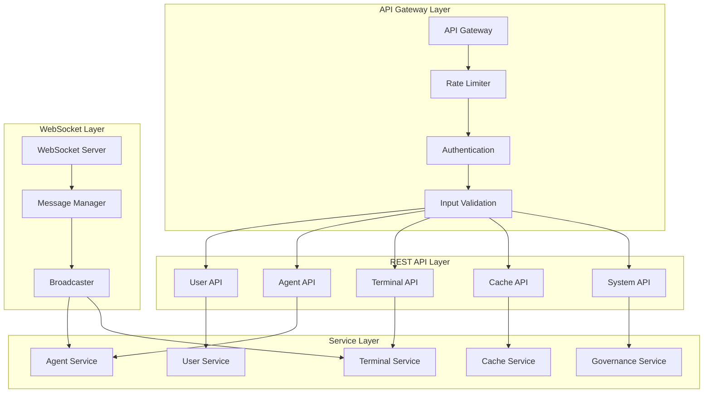

# API Contracts & Interface Specifications

**Version**: 1.0  
**Date**: 2025-01-27  
**Author**: Dr. Sarah Chen v1.2  
**Reviewers**: Alex Novak v3.0, Morgan Hayes v2.0  
**Status**: Draft  
**Purpose**: Define REST API contracts, WebSocket protocols, and integration interfaces  
**Audience**: Frontend team, Backend team, Integration team  

---

## Overview

The AI Development Assistant exposes a comprehensive REST API with WebSocket support for real-time updates. All APIs implement defensive programming patterns with input validation, rate limiting, error handling, and comprehensive monitoring. This document defines the complete API surface with OpenAPI 3.0 specifications.

## API Architecture



## Base API Configuration

### OpenAPI Specification Header
```yaml
openapi: 3.0.3
info:
  title: AI Development Assistant API
  description: Comprehensive API for AI agent management and terminal integration
  version: 1.0.0
  contact:
    name: Dr. Sarah Chen
    email: sarah.chen@company.com
  license:
    name: MIT
    url: https://opensource.org/licenses/MIT

servers:
  - url: http://localhost:8000
    description: Development server
  - url: https://api.ai-assistant.dev
    description: Production server

security:
  - BearerAuth: []

components:
  securitySchemes:
    BearerAuth:
      type: http
      scheme: bearer
      bearerFormat: JWT
      
  schemas:
    Error:
      type: object
      required: [error, message, timestamp]
      properties:
        error:
          type: string
          example: "ValidationError"
        message:
          type: string
          example: "Invalid input parameters"
        details:
          type: object
        timestamp:
          type: string
          format: date-time
        correlation_id:
          type: string
          format: uuid
```

### Standard Response Formats
```typescript
// Success Response Format
interface APIResponse<T> {
  success: true;
  data: T;
  metadata?: {
    timestamp: string;
    correlation_id: string;
    version: string;
    processing_time_ms: number;
  };
}

// Error Response Format  
interface APIError {
  success: false;
  error: string;
  message: string;
  details?: Record<string, any>;
  metadata: {
    timestamp: string;
    correlation_id: string;
    error_code: string;
  };
}

// Paginated Response Format
interface PaginatedResponse<T> {
  success: true;
  data: T[];
  pagination: {
    page: number;
    limit: number;
    total: number;
    has_next: boolean;
    has_previous: boolean;
  };
  metadata: ResponseMetadata;
}
```

## User Management API

### User Authentication
```yaml
paths:
  /auth/login:
    post:
      summary: User authentication
      tags: [Authentication]
      requestBody:
        required: true
        content:
          application/json:
            schema:
              type: object
              required: [email, password]
              properties:
                email:
                  type: string
                  format: email
                  example: "user@example.com"
                password:
                  type: string
                  minLength: 8
                  example: "securepassword123"
                remember_me:
                  type: boolean
                  default: false
      responses:
        '200':
          description: Successful authentication
          content:
            application/json:
              schema:
                type: object
                properties:
                  success:
                    type: boolean
                    example: true
                  data:
                    type: object
                    properties:
                      access_token:
                        type: string
                      refresh_token:
                        type: string
                      expires_in:
                        type: integer
                        example: 3600
                      user:
                        $ref: '#/components/schemas/User'
        '401':
          description: Authentication failed
          content:
            application/json:
              schema:
                $ref: '#/components/schemas/Error'
```

### User Profile Management
```typescript
// GET /users/profile - Get current user profile
interface UserProfile {
  user_id: string;
  email: string;
  username: string;
  full_name: string;
  preferences: UserPreferences;
  created_at: string;
  last_active_at: string;
  is_active: boolean;
}

interface UserPreferences {
  theme: 'light' | 'dark' | 'auto';
  terminal_shell: string;
  ai_model_preference: string;
  notification_settings: {
    agent_completion: boolean;
    system_alerts: boolean;
    governance_notifications: boolean;
  };
  privacy_settings: {
    data_retention_days: number;
    analytics_opt_out: boolean;
  };
}

// PUT /users/profile - Update user profile
interface UpdateUserProfileRequest {
  full_name?: string;
  preferences?: Partial<UserPreferences>;
}
```

## Agent Management API

### Agent Lifecycle Operations
```yaml
paths:
  /agents:
    post:
      summary: Create new AI agent
      tags: [Agents]
      requestBody:
        required: true
        content:
          application/json:
            schema:
              type: object
              required: [agent_type, configuration]
              properties:
                agent_type:
                  type: string
                  enum: [code_assistant, data_analyst, content_creator]
                  example: "code_assistant"
                configuration:
                  type: object
                  properties:
                    model:
                      type: string
                      example: "claude-3-sonnet"
                    max_tokens:
                      type: integer
                      minimum: 100
                      maximum: 8000
                      example: 4000
                    temperature:
                      type: number
                      minimum: 0
                      maximum: 2
                      example: 0.7
                    personas:
                      type: array
                      items:
                        type: string
                      example: ["alex_novak", "sarah_chen"]
                    governance_level:
                      type: string
                      enum: [strict, moderate, permissive]
                      example: "strict"
                context:
                  type: object
                  properties:
                    project_path:
                      type: string
                    working_directory:
                      type: string
                    environment_variables:
                      type: object
      responses:
        '201':
          description: Agent created successfully
          content:
            application/json:
              schema:
                type: object
                properties:
                  success:
                    type: boolean
                  data:
                    $ref: '#/components/schemas/Agent'
        '400':
          description: Invalid agent configuration
        '403':
          description: Governance validation failed
        '429':
          description: Rate limit exceeded
```

### Agent Status and Control
```typescript
// GET /agents/{agent_id} - Get agent status
interface AgentStatus {
  agent_id: string;
  status: 'initializing' | 'running' | 'paused' | 'completed' | 'failed' | 'terminated';
  agent_type: string;
  created_at: string;
  started_at?: string;
  completed_at?: string;
  configuration: AgentConfiguration;
  governance_state: GovernanceState;
  metrics: AgentMetrics;
  error_details?: ErrorDetails;
}

interface AgentMetrics {
  requests_processed: number;
  tokens_used: {
    input: number;
    output: number;
    total: number;
  };
  cost_usd: number;
  average_response_time_ms: number;
  success_rate: number;
  last_activity: string;
}

// POST /agents/{agent_id}/actions - Control agent
interface AgentActionRequest {
  action: 'pause' | 'resume' | 'terminate' | 'reset';
  reason?: string;
  force?: boolean;
}

// GET /agents/{agent_id}/interactions - Get agent interactions
interface AgentInteraction {
  interaction_id: string;
  timestamp: string;
  type: 'user_input' | 'agent_response' | 'system_event';
  content: string;
  metadata: {
    tokens_used?: number;
    response_time_ms?: number;
    personas_active?: string[];
    governance_checks?: GovernanceCheck[];
  };
}
```

## Terminal Integration API

### PTY Session Management
```yaml
paths:
  /terminals:
    post:
      summary: Create new terminal session
      tags: [Terminal]
      requestBody:
        required: true
        content:
          application/json:
            schema:
              type: object
              properties:
                shell:
                  type: string
                  example: "/bin/bash"
                  default: "/bin/bash"
                cwd:
                  type: string
                  example: "/home/user/project"
                environment:
                  type: object
                  additionalProperties:
                    type: string
                  example:
                    PATH: "/usr/local/bin:/usr/bin:/bin"
                    NODE_ENV: "development"
                dimensions:
                  type: object
                  properties:
                    cols:
                      type: integer
                      example: 80
                    rows:
                      type: integer
                      example: 24
      responses:
        '201':
          description: Terminal session created
          content:
            application/json:
              schema:
                type: object
                properties:
                  success:
                    type: boolean
                  data:
                    type: object
                    properties:
                      terminal_id:
                        type: string
                        format: uuid
                      initial_output:
                        type: string
                      shell:
                        type: string
                      cwd:
                        type: string
                      created_at:
                        type: string
                        format: date-time
```

### Terminal Command Execution
```typescript
// POST /terminals/{terminal_id}/execute - Execute command
interface TerminalExecuteRequest {
  command: string;
  timeout_seconds?: number;
  capture_output?: boolean;
}

interface TerminalExecuteResponse {
  success: boolean;
  execution_id: string;
  output?: string;
  exit_code?: number;
  execution_time_ms: number;
  still_running: boolean;
}

// GET /terminals/{terminal_id}/output - Get terminal output
interface TerminalOutputResponse {
  success: boolean;
  data: {
    output: string;
    output_type: 'stdout' | 'stderr' | 'combined';
    sequence_number: number;
    timestamp: string;
  };
}

// PUT /terminals/{terminal_id}/resize - Resize terminal
interface TerminalResizeRequest {
  cols: number;
  rows: number;
}
```

## Cache Management API

### Cache Operations
```yaml
paths:
  /cache/{key}:
    get:
      summary: Get cached value
      tags: [Cache]
      parameters:
        - name: key
          in: path
          required: true
          schema:
            type: string
          example: "user:123:preferences"
        - name: include_metadata
          in: query
          schema:
            type: boolean
            default: false
      responses:
        '200':
          description: Cache hit
          content:
            application/json:
              schema:
                type: object
                properties:
                  success:
                    type: boolean
                  data:
                    type: object
                    properties:
                      value:
                        type: object
                      metadata:
                        type: object
                        properties:
                          cached_at:
                            type: string
                            format: date-time
                          expires_at:
                            type: string
                            format: date-time
                          hit_count:
                            type: integer
                          cache_tier:
                            type: string
                            enum: [hot, warm]
        '404':
          description: Cache miss
    put:
      summary: Set cache value
      tags: [Cache]
      parameters:
        - name: key
          in: path
          required: true
          schema:
            type: string
      requestBody:
        required: true
        content:
          application/json:
            schema:
              type: object
              required: [value]
              properties:
                value:
                  type: object
                ttl_seconds:
                  type: integer
                  minimum: 1
                  maximum: 86400
                  example: 3600
                tags:
                  type: array
                  items:
                    type: string
```

### Cache Administration
```typescript
// GET /cache/stats - Get cache statistics
interface CacheStats {
  hot_cache: {
    size_bytes: number;
    max_size_bytes: number;
    hit_rate: number;
    entry_count: number;
    eviction_count: number;
  };
  warm_cache: {
    size_bytes: number;
    max_size_bytes: number;
    hit_rate: number;
    entry_count: number;
    disk_operations: number;
  };
  overall_stats: {
    total_requests: number;
    cache_hit_rate: number;
    average_response_time_ms: number;
    error_rate: number;
  };
}

// DELETE /cache/keys - Bulk delete cache entries
interface CacheBulkDeleteRequest {
  keys?: string[];
  pattern?: string;
  tags?: string[];
}

// POST /cache/clear - Clear cache with filters
interface CacheClearRequest {
  tier?: 'hot' | 'warm' | 'all';
  pattern?: string;
  older_than_hours?: number;
}
```

## System Administration API

### Health and Status
```yaml
paths:
  /health:
    get:
      summary: System health check
      tags: [System]
      responses:
        '200':
          description: System healthy
          content:
            application/json:
              schema:
                type: object
                properties:
                  status:
                    type: string
                    example: "healthy"
                  checks:
                    type: object
                    properties:
                      database:
                        type: object
                        properties:
                          status:
                            type: string
                            enum: [healthy, degraded, unhealthy]
                          response_time_ms:
                            type: number
                          connection_count:
                            type: integer
                      cache:
                        type: object
                        properties:
                          status:
                            type: string
                          hot_cache_hit_rate:
                            type: number
                          warm_cache_hit_rate:
                            type: number
                      websocket:
                        type: object
                        properties:
                          status:
                            type: string
                          active_connections:
                            type: integer
                          message_rate:
                            type: number
                      ai_service:
                        type: object
                        properties:
                          status:
                            type: string
                          last_successful_call:
                            type: string
                            format: date-time
                          circuit_breaker_state:
                            type: string
                            enum: [closed, open, half_open]
```

### System Metrics
```typescript
// GET /metrics - Prometheus-formatted metrics
interface SystemMetrics {
  api_requests_total: number;
  api_request_duration_seconds: HistogramMetric;
  websocket_connections_active: number;
  cache_hit_rate: number;
  database_connections_active: number;
  agent_sessions_active: number;
  terminal_sessions_active: number;
  memory_usage_bytes: number;
  cpu_usage_percent: number;
  governance_rejections_total: number;
  error_rate: number;
}

// GET /system/info - System information
interface SystemInfo {
  version: string;
  build_date: string;
  commit_hash: string;
  environment: 'development' | 'staging' | 'production';
  uptime_seconds: number;
  features_enabled: string[];
  configuration: {
    max_agents_per_user: number;
    max_terminals_per_user: number;
    cache_size_mb: number;
    database_pool_size: number;
  };
}
```

## WebSocket Protocol

### Connection and Authentication
```typescript
// WebSocket connection with JWT authentication
interface WebSocketConnectionRequest {
  type: 'auth';
  token: string;
  subscriptions?: string[];
}

interface WebSocketConnectionResponse {
  type: 'auth_response';
  success: boolean;
  session_id?: string;
  error?: string;
}
```

### Message Types
```typescript
// Agent status updates
interface AgentStatusMessage {
  type: 'agent_status';
  agent_id: string;
  status: AgentStatus;
  timestamp: string;
}

// Terminal output streaming
interface TerminalOutputMessage {
  type: 'terminal_output';
  terminal_id: string;
  output: string;
  output_type: 'stdout' | 'stderr';
  timestamp: string;
}

// System alerts
interface SystemAlertMessage {
  type: 'system_alert';
  severity: 'info' | 'warning' | 'error' | 'critical';
  title: string;
  message: string;
  details?: Record<string, any>;
  timestamp: string;
}

// Governance notifications
interface GovernanceNotificationMessage {
  type: 'governance_notification';
  event_type: string;
  agent_id?: string;
  decision: 'approved' | 'rejected' | 'pending';
  reason?: string;
  timestamp: string;
}
```

### Subscription Management
```typescript
// Subscribe to specific topics
interface WebSocketSubscribeMessage {
  type: 'subscribe';
  topics: string[];
  filters?: Record<string, any>;
}

// Unsubscribe from topics
interface WebSocketUnsubscribeMessage {
  type: 'unsubscribe';
  topics: string[];
}

// Available subscription topics
type SubscriptionTopic = 
  | 'agent_status'
  | 'terminal_output'
  | 'system_alerts'
  | 'governance_notifications'
  | 'cache_events'
  | 'user_activity';
```

## Error Handling

### Standard Error Codes
```typescript
enum APIErrorCode {
  // Client errors (4xx)
  BAD_REQUEST = 'BAD_REQUEST',
  UNAUTHORIZED = 'UNAUTHORIZED',
  FORBIDDEN = 'FORBIDDEN',
  NOT_FOUND = 'NOT_FOUND',
  METHOD_NOT_ALLOWED = 'METHOD_NOT_ALLOWED',
  CONFLICT = 'CONFLICT',
  VALIDATION_ERROR = 'VALIDATION_ERROR',
  RATE_LIMIT_EXCEEDED = 'RATE_LIMIT_EXCEEDED',
  
  // Server errors (5xx)
  INTERNAL_SERVER_ERROR = 'INTERNAL_SERVER_ERROR',
  SERVICE_UNAVAILABLE = 'SERVICE_UNAVAILABLE',
  DATABASE_ERROR = 'DATABASE_ERROR',
  CACHE_ERROR = 'CACHE_ERROR',
  AI_SERVICE_ERROR = 'AI_SERVICE_ERROR',
  GOVERNANCE_ERROR = 'GOVERNANCE_ERROR',
  CIRCUIT_BREAKER_OPEN = 'CIRCUIT_BREAKER_OPEN'
}

interface DetailedError {
  code: APIErrorCode;
  message: string;
  field?: string;
  value?: any;
  constraint?: string;
}
```

### Error Response Examples
```yaml
components:
  examples:
    ValidationError:
      value:
        success: false
        error: "ValidationError"
        message: "Request validation failed"
        details:
          - field: "agent_type"
            message: "Invalid agent type"
            allowed_values: ["code_assistant", "data_analyst"]
          - field: "max_tokens"
            message: "Value must be between 100 and 8000"
        metadata:
          timestamp: "2025-01-27T10:30:00Z"
          correlation_id: "123e4567-e89b-12d3-a456-426614174000"
          error_code: "VALIDATION_ERROR"
    
    GovernanceRejection:
      value:
        success: false
        error: "GovernanceError"
        message: "Agent creation blocked by governance"
        details:
          framework: "sarah_three_questions"
          reason: "Estimated cost exceeds budget limit"
          estimated_cost: 150.50
          budget_remaining: 75.25
        metadata:
          timestamp: "2025-01-27T10:30:00Z"
          correlation_id: "123e4567-e89b-12d3-a456-426614174000"
          error_code: "GOVERNANCE_ERROR"
```

## Rate Limiting

### Rate Limit Configuration
```typescript
interface RateLimitConfig {
  // Per-endpoint limits
  endpoints: {
    '/auth/login': { requests: 5, window_minutes: 15 };
    '/agents': { requests: 10, window_minutes: 1 };
    '/terminals': { requests: 3, window_minutes: 1 };
    '/cache/*': { requests: 100, window_minutes: 1 };
  };
  
  // Per-user global limits
  user_limits: {
    requests_per_minute: 100;
    requests_per_hour: 2000;
    requests_per_day: 10000;
  };
  
  // IP-based limits for unauthenticated requests
  ip_limits: {
    requests_per_minute: 20;
    requests_per_hour: 200;
  };
}
```

### Rate Limit Headers
```http
HTTP/1.1 200 OK
X-RateLimit-Limit: 100
X-RateLimit-Remaining: 85
X-RateLimit-Reset: 1643723400
X-RateLimit-Window: 60
Retry-After: 45
```

## API Versioning

### Version Strategy
```typescript
// URL-based versioning
const API_VERSIONS = {
  v1: {
    base_path: '/api/v1',
    supported_until: '2025-12-31',
    deprecated: false
  },
  v2: {
    base_path: '/api/v2',
    supported_until: null,
    deprecated: false,
    breaking_changes: [
      'Agent configuration schema updated',
      'WebSocket message format changed',
      'Error response format standardized'
    ]
  }
};

// Header-based version negotiation
interface APIVersionHeaders {
  'API-Version': string;
  'Accept-Version': string;
  'Deprecation': string;
  'Sunset': string;
}
```

## Testing Contracts

### API Test Scenarios
```typescript
interface APITestContract {
  endpoint: string;
  method: string;
  scenarios: TestScenario[];
}

interface TestScenario {
  name: string;
  request: {
    headers?: Record<string, string>;
    body?: any;
    query?: Record<string, string>;
  };
  expected_response: {
    status: number;
    body_schema: string;
    headers?: Record<string, string>;
  };
  setup?: () => Promise<void>;
  cleanup?: () => Promise<void>;
}

const AGENT_API_TESTS: APITestContract = {
  endpoint: '/agents',
  method: 'POST',
  scenarios: [
    {
      name: 'Create agent with valid configuration',
      request: {
        body: {
          agent_type: 'code_assistant',
          configuration: {
            model: 'claude-3-sonnet',
            max_tokens: 4000
          }
        }
      },
      expected_response: {
        status: 201,
        body_schema: 'AgentResponse'
      }
    },
    {
      name: 'Reject agent creation with invalid type',
      request: {
        body: {
          agent_type: 'invalid_type',
          configuration: {}
        }
      },
      expected_response: {
        status: 400,
        body_schema: 'ValidationError'
      }
    }
  ]
};
```

---

**Next Review**: February 27, 2025  
**Dependencies**: Backend implementation, frontend integration  
**Related**: [`backend-architecture.md`](../component-design/backend-architecture.md), [`ipc-communication.md`](./ipc-communication.md)