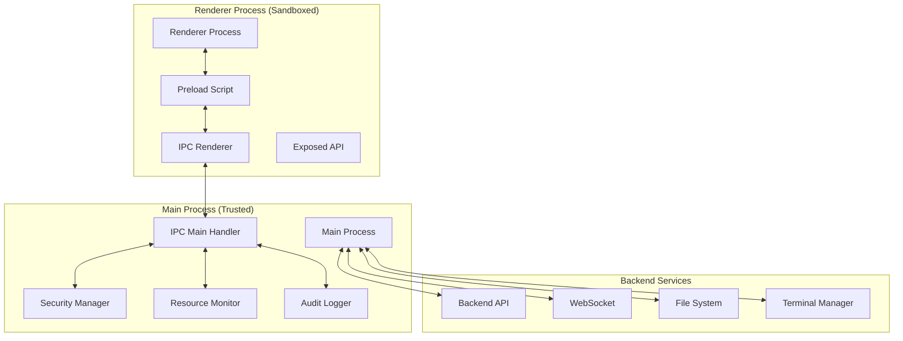

# IPC Communication Patterns & Security

**Version**: 1.0  
**Date**: 2025-01-27  
**Author**: Alex Novak v3.0  
**Reviewers**: Morgan Hayes v2.0, Dr. Sarah Chen v1.2  
**Status**: Draft  
**Purpose**: Define secure IPC patterns and communication protocols for Electron  
**Audience**: Frontend team, Security team  

---

## Overview

Inter-Process Communication (IPC) in our Electron application implements secure, validated message passing between the main process and renderer processes. All communication follows the principle of least privilege with comprehensive input validation, rate limiting, and audit logging to prevent security vulnerabilities and resource exhaustion.

## IPC Architecture



## Security Model

### Context Isolation Implementation
```typescript
// main.js - Secure window creation with context isolation
function createSecureWindow(): BrowserWindow {
  const mainWindow = new BrowserWindow({
    width: 1200,
    height: 800,
    webSecurity: true,
    contextIsolation: true,
    enableRemoteModule: false,
    nodeIntegration: false,
    sandbox: false, // Disabled for preload script access
    preload: path.join(__dirname, 'preload.js'),
    webPreferences: {
      // Additional security hardening
      allowRunningInsecureContent: false,
      experimentalFeatures: false,
      plugins: false,
      webSecurity: true,
      contextIsolation: true,
      nodeIntegration: false,
      nodeIntegrationInWorker: false,
      nodeIntegrationInSubFrames: false
    }
  });
  
  // Set Content Security Policy
  mainWindow.webContents.session.webRequest.onHeadersReceived(
    (details, callback) => {
      callback({
        responseHeaders: {
          ...details.responseHeaders,
          'Content-Security-Policy': [
            "default-src 'self'; " +
            "script-src 'self'; " +
            "style-src 'self' 'unsafe-inline'; " +
            "img-src 'self' data: https:; " +
            "connect-src 'self' ws://localhost:* http://localhost:*"
          ]
        }
      });
    }
  );
  
  return mainWindow;
}
```

### Preload Script Security
```typescript
// preload.js - Minimal, validated API exposure
import { contextBridge, ipcRenderer } from 'electron';

// Security validation utilities
class IPCSecurityValidator {
  private static readonly MAX_PAYLOAD_SIZE = 1024 * 1024; // 1MB
  private static readonly ALLOWED_CHANNELS = new Set([
    'agent:create',
    'agent:query',
    'agent:terminate',
    'terminal:create',
    'terminal:execute',
    'terminal:close',
    'cache:get',
    'cache:set',
    'websocket:connect',
    'websocket:disconnect',
    'file:read',
    'file:write',
    'system:info'
  ]);
  
  static validateChannel(channel: string): boolean {
    return this.ALLOWED_CHANNELS.has(channel);
  }
  
  static validatePayload(data: any): boolean {
    if (data === null || data === undefined) return true;
    
    const serialized = JSON.stringify(data);
    return serialized.length <= this.MAX_PAYLOAD_SIZE;
  }
  
  static sanitizeData(data: any): any {
    // Remove potentially dangerous properties
    if (typeof data === 'object' && data !== null) {
      const sanitized = { ...data };
      delete sanitized.__proto__;
      delete sanitized.constructor;
      delete sanitized.prototype;
      return sanitized;
    }
    return data;
  }
}

// Secure API exposure
const electronAPI = {
  // Secure invoke with validation
  invoke: async (channel: string, data?: any): Promise<any> => {
    // Channel validation
    if (!IPCSecurityValidator.validateChannel(channel)) {
      throw new Error(`Unauthorized IPC channel: ${channel}`);
    }
    
    // Payload validation
    if (!IPCSecurityValidator.validatePayload(data)) {
      throw new Error('IPC payload too large or invalid');
    }
    
    // Data sanitization
    const sanitizedData = IPCSecurityValidator.sanitizeData(data);
    
    try {
      return await ipcRenderer.invoke('secure-ipc', channel, sanitizedData);
    } catch (error) {
      console.error(`IPC call failed for channel ${channel}:`, error);
      throw new Error(`IPC operation failed: ${error.message}`);
    }
  },
  
  // Event listeners with automatic cleanup
  on: (channel: string, callback: Function) => {
    if (!IPCSecurityValidator.validateChannel(channel)) {
      throw new Error(`Unauthorized IPC channel: ${channel}`);
    }
    
    const wrappedCallback = (event: any, ...args: any[]) => {
      // Sanitize incoming data
      const sanitizedArgs = args.map(arg => 
        IPCSecurityValidator.sanitizeData(arg)
      );
      callback(event, ...sanitizedArgs);
    };
    
    ipcRenderer.on(channel, wrappedCallback);
    
    // Return cleanup function
    return () => ipcRenderer.removeListener(channel, wrappedCallback);
  },
  
  // One-time listeners with timeout
  once: (channel: string, callback: Function, timeout: number = 30000) => {
    if (!IPCSecurityValidator.validateChannel(channel)) {
      throw new Error(`Unauthorized IPC channel: ${channel}`);
    }
    
    const timeoutId = setTimeout(() => {
      ipcRenderer.removeAllListeners(channel);
      callback(new Error('IPC timeout'));
    }, timeout);
    
    ipcRenderer.once(channel, (event, ...args) => {
      clearTimeout(timeoutId);
      const sanitizedArgs = args.map(arg => 
        IPCSecurityValidator.sanitizeData(arg)
      );
      callback(null, ...sanitizedArgs);
    });
  }
};

// Expose secure API to renderer
contextBridge.exposeInMainWorld('electronAPI', electronAPI);

// Block access to Node.js APIs
delete (window as any).require;
delete (window as any).exports;
delete (window as any).module;
```

## Main Process IPC Handler

```typescript
// main-ipc-handler.ts - Secure main process IPC handling
import { ipcMain, BrowserWindow } from 'electron';

class SecureIPCHandler {
  private rateLimiter: Map<string, RateLimiter> = new Map();
  private auditLogger: AuditLogger;
  private resourceMonitor: ResourceMonitor;
  
  constructor() {
    this.auditLogger = new AuditLogger();
    this.resourceMonitor = new ResourceMonitor();
    this.setupSecureHandlers();
  }
  
  private setupSecureHandlers(): void {
    // Main secure IPC handler
    ipcMain.handle('secure-ipc', async (event, channel: string, data: any) => {
      const processId = event.processId;
      const correlationId = this.generateCorrelationId();
      
      try {
        // Rate limiting per process
        if (!await this.checkRateLimit(processId, channel)) {
          this.auditLogger.logSecurityViolation('IPC_RATE_LIMIT', {
            processId,
            channel,
            correlationId
          });
          throw new Error('IPC rate limit exceeded');
        }
        
        // Resource monitoring
        if (!this.resourceMonitor.checkMemoryLimits()) {
          throw new Error('System resource limits exceeded');
        }
        
        // Route to appropriate handler
        const result = await this.routeSecureMessage(channel, data, {
          processId,
          correlationId,
          timestamp: Date.now()
        });
        
        // Log successful operation
        this.auditLogger.logIPCOperation('SUCCESS', {
          channel,
          processId,
          correlationId,
          dataSize: JSON.stringify(data).length
        });
        
        return result;
        
      } catch (error) {
        // Log failed operation
        this.auditLogger.logIPCOperation('FAILURE', {
          channel,
          processId,
          correlationId,
          error: error.message
        });
        throw error;
      }
    });
  }
  
  private async checkRateLimit(processId: number, channel: string): Promise<boolean> {
    const key = `${processId}:${channel}`;
    
    if (!this.rateLimiter.has(key)) {
      this.rateLimiter.set(key, new RateLimiter({
        maxRequests: 100,
        windowMs: 60000, // 1 minute
        skipSuccessfulRequests: false
      }));
    }
    
    const limiter = this.rateLimiter.get(key)!;
    return await limiter.checkLimit();
  }
  
  private async routeSecureMessage(
    channel: string, 
    data: any, 
    context: IPCContext
  ): Promise<any> {
    // Route to specific handlers based on channel
    switch (true) {
      case channel.startsWith('agent:'):
        return await this.handleAgentOperation(channel, data, context);
      
      case channel.startsWith('terminal:'):
        return await this.handleTerminalOperation(channel, data, context);
      
      case channel.startsWith('cache:'):
        return await this.handleCacheOperation(channel, data, context);
      
      case channel.startsWith('websocket:'):
        return await this.handleWebSocketOperation(channel, data, context);
      
      case channel.startsWith('file:'):
        return await this.handleFileOperation(channel, data, context);
      
      case channel.startsWith('system:'):
        return await this.handleSystemOperation(channel, data, context);
      
      default:
        throw new Error(`Unknown IPC channel: ${channel}`);
    }
  }
}
```

## Channel-Specific Handlers

### Agent Operations
```typescript
class AgentIPCHandler {
  private agentManager: AgentManager;
  private governanceEngine: GovernanceEngine;
  
  async handleAgentOperation(
    channel: string, 
    data: any, 
    context: IPCContext
  ): Promise<any> {
    const operation = channel.split(':')[1];
    
    switch (operation) {
      case 'create':
        return await this.createAgent(data, context);
      
      case 'query':
        return await this.queryAgent(data, context);
      
      case 'terminate':
        return await this.terminateAgent(data, context);
      
      default:
        throw new Error(`Unknown agent operation: ${operation}`);
    }
  }
  
  private async createAgent(data: AgentCreateRequest, context: IPCContext): Promise<AgentResponse> {
    // Validate input
    if (!data.agentType || !data.configuration) {
      throw new ValidationError('Missing required agent parameters');
    }
    
    // Governance validation
    const governanceResult = await this.governanceEngine.validateAgentCreation({
      agentType: data.agentType,
      configuration: data.configuration,
      requestContext: context
    });
    
    if (!governanceResult.approved) {
      throw new GovernanceError(`Agent creation blocked: ${governanceResult.reason}`);
    }
    
    // Create agent with timeout
    const agent = await Promise.race([
      this.agentManager.createAgent(data.agentType, data.configuration),
      this.timeoutPromise(30000, 'Agent creation timeout')
    ]);
    
    return {
      success: true,
      agentId: agent.id,
      status: agent.status,
      createdAt: agent.createdAt
    };
  }
  
  private async queryAgent(data: AgentQueryRequest, context: IPCContext): Promise<AgentQueryResponse> {
    // Validate agent exists and user has access
    const agent = await this.agentManager.getAgent(data.agentId);
    if (!agent) {
      throw new NotFoundError('Agent not found');
    }
    
    // Check permissions
    if (!await this.checkAgentAccess(agent.id, context.processId)) {
      throw new AuthorizationError('Access denied to agent');
    }
    
    return {
      success: true,
      agent: {
        id: agent.id,
        status: agent.status,
        type: agent.type,
        lastActivity: agent.lastActivity
      }
    };
  }
}
```

### Terminal Operations
```typescript
class TerminalIPCHandler {
  private ptyManager: PTYManager;
  private terminalSecurity: TerminalSecurityManager;
  
  async handleTerminalOperation(
    channel: string, 
    data: any, 
    context: IPCContext
  ): Promise<any> {
    const operation = channel.split(':')[1];
    
    switch (operation) {
      case 'create':
        return await this.createTerminal(data, context);
      
      case 'execute':
        return await this.executeCommand(data, context);
      
      case 'close':
        return await this.closeTerminal(data, context);
      
      default:
        throw new Error(`Unknown terminal operation: ${operation}`);
    }
  }
  
  private async createTerminal(data: TerminalCreateRequest, context: IPCContext): Promise<TerminalResponse> {
    // Validate shell request
    if (!this.terminalSecurity.isAllowedShell(data.shell)) {
      throw new SecurityError('Shell not allowed');
    }
    
    // Check concurrent terminal limits
    const activeSessions = await this.ptyManager.getActiveSessionCount(context.processId);
    if (activeSessions >= MAX_TERMINALS_PER_PROCESS) {
      throw new ResourceError('Terminal limit exceeded');
    }
    
    // Create PTY session with security restrictions
    const terminal = await this.ptyManager.createSession({
      shell: data.shell || '/bin/bash',
      cwd: this.terminalSecurity.sanitizePath(data.cwd),
      env: this.terminalSecurity.filterEnvironment(data.env),
      processId: context.processId,
      correlationId: context.correlationId
    });
    
    return {
      success: true,
      terminalId: terminal.id,
      initialOutput: terminal.getInitialOutput()
    };
  }
  
  private async executeCommand(data: TerminalExecuteRequest, context: IPCContext): Promise<TerminalExecuteResponse> {
    // Validate terminal exists and belongs to process
    const terminal = await this.ptyManager.getSession(data.terminalId);
    if (!terminal || terminal.processId !== context.processId) {
      throw new AuthorizationError('Terminal access denied');
    }
    
    // Command security validation
    if (!this.terminalSecurity.isCommandAllowed(data.command)) {
      this.auditLogger.logSecurityViolation('BLOCKED_COMMAND', {
        command: data.command,
        terminalId: data.terminalId,
        processId: context.processId
      });
      throw new SecurityError('Command not allowed');
    }
    
    // Execute with timeout and resource limits
    try {
      const result = await Promise.race([
        terminal.execute(data.command),
        this.timeoutPromise(COMMAND_TIMEOUT, 'Command execution timeout')
      ]);
      
      return {
        success: true,
        output: result.output,
        exitCode: result.exitCode,
        executionTime: result.executionTime
      };
      
    } catch (error) {
      return {
        success: false,
        error: error.message,
        exitCode: -1
      };
    }
  }
}
```

## Resource Management

### Memory and Connection Limits
```typescript
class ResourceMonitor {
  private memoryThreshold = 512 * 1024 * 1024; // 512MB
  private connectionLimits: Map<string, number> = new Map([
    ['terminal', 10],
    ['websocket', 5],
    ['file', 20],
    ['agent', 3]
  ]);
  
  checkMemoryLimits(): boolean {
    const memUsage = process.memoryUsage();
    
    if (memUsage.heapUsed > this.memoryThreshold) {
      this.triggerGarbageCollection();
      
      // Check again after GC
      const newMemUsage = process.memoryUsage();
      if (newMemUsage.heapUsed > this.memoryThreshold) {
        return false;
      }
    }
    
    return true;
  }
  
  checkConnectionLimit(type: string, processId: number): boolean {
    const limit = this.connectionLimits.get(type) || 10;
    const currentCount = this.getConnectionCount(type, processId);
    return currentCount < limit;
  }
  
  private triggerGarbageCollection(): void {
    if (global.gc) {
      global.gc();
    }
  }
}
```

### Rate Limiting Implementation
```typescript
class RateLimiter {
  private requests: Map<string, number[]> = new Map();
  
  constructor(
    private maxRequests: number = 100,
    private windowMs: number = 60000
  ) {}
  
  async checkLimit(key: string = 'default'): Promise<boolean> {
    const now = Date.now();
    const requests = this.requests.get(key) || [];
    
    // Remove old requests outside the window
    const validRequests = requests.filter(
      timestamp => now - timestamp < this.windowMs
    );
    
    // Check if we're within limits
    if (validRequests.length >= this.maxRequests) {
      return false;
    }
    
    // Add current request
    validRequests.push(now);
    this.requests.set(key, validRequests);
    
    return true;
  }
  
  reset(key?: string): void {
    if (key) {
      this.requests.delete(key);
    } else {
      this.requests.clear();
    }
  }
}
```

## Error Handling & Recovery

### IPC Error Boundaries
```typescript
class IPCErrorHandler {
  private circuitBreaker: Map<string, CircuitBreaker> = new Map();
  private retryManager: RetryManager;
  
  async handleWithRecovery<T>(
    operation: () => Promise<T>,
    context: IPCContext
  ): Promise<T> {
    const channel = context.channel || 'unknown';
    
    // Get or create circuit breaker for this channel
    if (!this.circuitBreaker.has(channel)) {
      this.circuitBreaker.set(channel, new CircuitBreaker({
        timeout: 5000,
        errorThresholdPercentage: 50,
        resetTimeout: 30000
      }));
    }
    
    const breaker = this.circuitBreaker.get(channel)!;
    
    try {
      return await breaker.fire(operation);
    } catch (error) {
      // Log error with context
      this.auditLogger.logIPCError({
        channel,
        error: error.message,
        context,
        timestamp: Date.now()
      });
      
      // Determine if retry is appropriate
      if (this.isRetryableError(error)) {
        return await this.retryManager.retry(operation, {
          maxAttempts: 3,
          backoffMs: 1000,
          exponential: true
        });
      }
      
      throw this.wrapError(error, context);
    }
  }
  
  private isRetryableError(error: Error): boolean {
    const retryableTypes = [
      'TimeoutError',
      'NetworkError',
      'ServiceUnavailableError'
    ];
    
    return retryableTypes.includes(error.constructor.name);
  }
  
  private wrapError(error: Error, context: IPCContext): IPCError {
    return new IPCError(
      `IPC operation failed: ${error.message}`,
      {
        originalError: error,
        channel: context.channel,
        processId: context.processId,
        correlationId: context.correlationId
      }
    );
  }
}
```

## Performance Optimization

### IPC Message Batching
```typescript
class IPCBatchProcessor {
  private batchQueue: Map<string, IPCMessage[]> = new Map();
  private batchTimer: Map<string, NodeJS.Timeout> = new Map();
  private batchSize = 10;
  private batchTimeout = 100; // 100ms
  
  async queueMessage(channel: string, message: IPCMessage): Promise<any> {
    const queue = this.batchQueue.get(channel) || [];
    queue.push(message);
    this.batchQueue.set(channel, queue);
    
    // Process batch if full
    if (queue.length >= this.batchSize) {
      return await this.processBatch(channel);
    }
    
    // Set timeout for partial batch
    if (!this.batchTimer.has(channel)) {
      const timer = setTimeout(() => {
        this.processBatch(channel);
      }, this.batchTimeout);
      
      this.batchTimer.set(channel, timer);
    }
    
    // Return promise that resolves when batch is processed
    return new Promise((resolve, reject) => {
      message.resolve = resolve;
      message.reject = reject;
    });
  }
  
  private async processBatch(channel: string): Promise<void> {
    const messages = this.batchQueue.get(channel) || [];
    if (messages.length === 0) return;
    
    // Clear queue and timer
    this.batchQueue.delete(channel);
    const timer = this.batchTimer.get(channel);
    if (timer) {
      clearTimeout(timer);
      this.batchTimer.delete(channel);
    }
    
    try {
      const results = await this.executeBatch(channel, messages);
      
      // Resolve individual promises
      messages.forEach((message, index) => {
        if (message.resolve) {
          message.resolve(results[index]);
        }
      });
      
    } catch (error) {
      // Reject all promises in batch
      messages.forEach(message => {
        if (message.reject) {
          message.reject(error);
        }
      });
    }
  }
}
```

## Monitoring & Debugging

### IPC Performance Metrics
```typescript
class IPCMetricsCollector {
  private metrics = {
    totalRequests: new Counter(),
    requestDuration: new Histogram(),
    errorRate: new Gauge(),
    activeConnections: new Gauge(),
    rateLimitHits: new Counter(),
    memoryUsage: new Gauge()
  };
  
  recordRequest(channel: string, duration: number, success: boolean): void {
    this.metrics.totalRequests.inc({ channel });
    this.metrics.requestDuration.observe({ channel }, duration);
    
    if (!success) {
      this.metrics.errorRate.inc({ channel });
    }
  }
  
  recordRateLimitHit(processId: number, channel: string): void {
    this.metrics.rateLimitHits.inc({ 
      process_id: processId.toString(),
      channel 
    });
  }
  
  updateMemoryUsage(): void {
    const memUsage = process.memoryUsage();
    this.metrics.memoryUsage.set(memUsage.heapUsed);
  }
  
  getHealthScore(): number {
    const totalRequests = this.metrics.totalRequests.get();
    const errors = this.metrics.errorRate.get();
    
    if (totalRequests === 0) return 100;
    
    const errorRate = (errors / totalRequests) * 100;
    return Math.max(0, 100 - errorRate);
  }
}
```

### Debug Utilities
```typescript
class IPCDebugger {
  private isDebugMode = process.env.NODE_ENV === 'development';
  
  logIPCMessage(direction: 'send' | 'receive', channel: string, data: any): void {
    if (!this.isDebugMode) return;
    
    console.log(`[IPC ${direction.toUpperCase()}] ${channel}`, {
      timestamp: new Date().toISOString(),
      dataSize: JSON.stringify(data).length,
      data: this.truncateForLog(data)
    });
  }
  
  private truncateForLog(data: any, maxLength = 200): any {
    const serialized = JSON.stringify(data);
    if (serialized.length <= maxLength) return data;
    
    return {
      _truncated: true,
      _originalLength: serialized.length,
      _preview: serialized.substring(0, maxLength) + '...'
    };
  }
}
```

---

**Next Review**: February 27, 2025  
**Dependencies**: Frontend architecture, security boundaries  
**Related**: [`frontend-architecture.md`](../component-design/frontend-architecture.md), [`security-boundaries.md`](../component-design/security-boundaries.md)