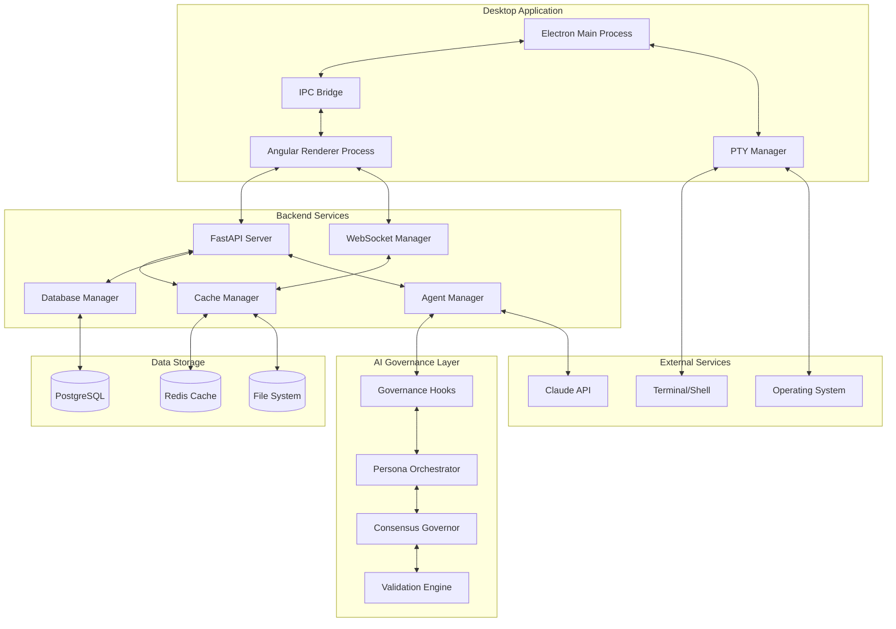
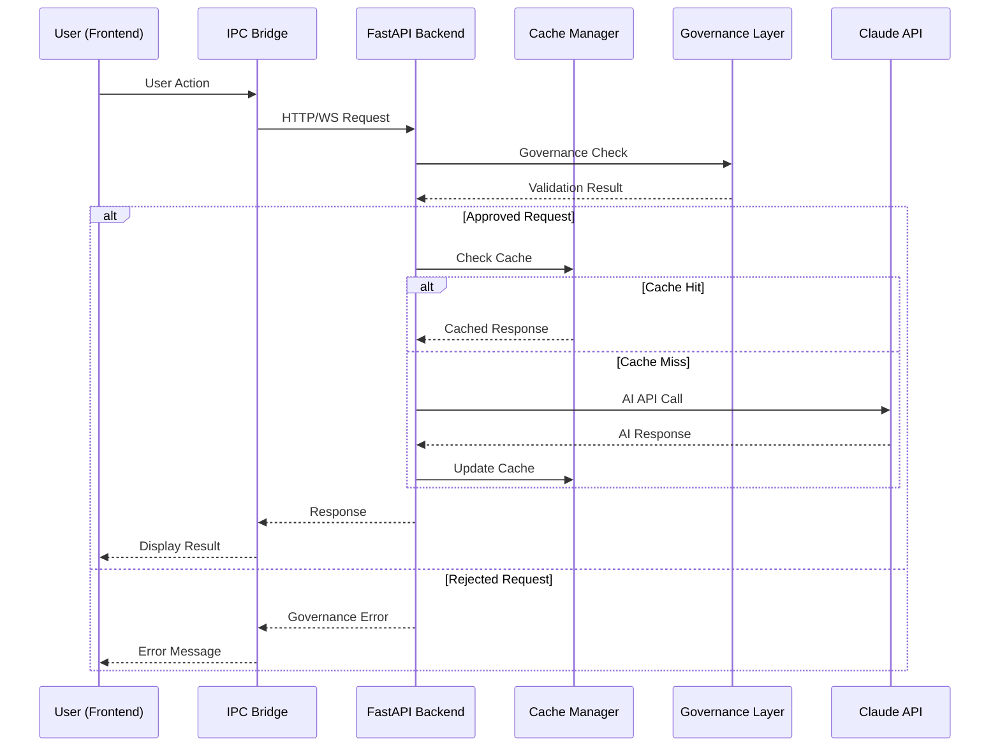

# AI Development Assistant - System Overview

**Version**: 1.0  
**Date**: 2025-01-27  
**Author**: Alex Novak v3.0 with Dr. Sarah Chen v1.2  
**Reviewers**: Quinn Roberts v1.1, Maya Patel v3.0  
**Status**: Draft  
**Purpose**: High-level system architecture and component interaction overview  
**Audience**: All development team members, stakeholders  

---

## Overview

The AI Development Assistant is a desktop application prototype built on Electron + Angular frontend with Python FastAPI backend, implementing intelligent caching, real-time monitoring, and AI agent orchestration. The system uses defensive programming patterns throughout and implements comprehensive governance for AI operations.

## System Architecture

## Core Components

### Frontend Layer (Alex Novak's Domain)
- **Electron Main Process**: Application lifecycle, window management, security boundaries
- **Angular Renderer**: Modern component architecture with Material Design
- **IPC Bridge**: Secure communication between main and renderer processes
- **PTY Manager**: Terminal session management and process coordination

### Backend Layer (Dr. Sarah Chen's Domain)
- **FastAPI Server**: REST API with lifecycle management and CORS
- **WebSocket Manager**: Real-time updates and metrics broadcasting
- **Cache Manager**: Two-tier caching (hot/warm) with failure resilience
- **Database Manager**: PostgreSQL integration with connection pooling
- **Agent Manager**: AI agent simulation and orchestration

### AI Governance Layer (Multi-Persona Orchestration)
- **Governance Hooks**: Lifecycle validation and cost control
- **Persona Orchestrator**: Dynamic persona selection and routing
- **Consensus Governor**: Dual-framework validation (Sarah + Alex)
- **Validation Engine**: Four-gate validation pipeline

## Data Flow Patterns

### Request Processing Flow

### Data Storage Strategy
- **Hot Cache**: In-memory, 100MB limit, <1ms access
- **Warm Cache**: Disk-backed, 500MB limit, <10ms access
- **Database**: PostgreSQL for persistent data, connection pooling
- **File System**: Configuration, logs, temporary files

## Security Boundaries

### Process Isolation
- **Main Process**: System APIs, file access, security enforcement
- **Renderer Process**: UI rendering, limited API access via IPC
- **Backend Process**: Business logic, data processing, AI integration

### Communication Security
- **IPC**: Context isolation, validated message passing
- **API**: JWT authentication, rate limiting, input validation
- **Database**: Connection encryption, prepared statements
- **External APIs**: Token-based auth, circuit breaker protection

## Performance Characteristics

### Resource Limits (Defensive Programming)
- **Frontend Memory**: 500MB renderer process limit
- **Backend Memory**: 2GB per process limit
- **Database Connections**: 20 max, 5 min pool
- **Cache Size**: 600MB total across tiers
- **WebSocket Connections**: 10,000 max with backpressure

### Performance Targets
- **API Response Time**: <500ms (95th percentile)
- **Cache Hit Rate**: >90% for hot cache
- **IPC Latency**: <100ms for round-trip
- **UI Responsiveness**: 60fps, <16ms frame time

## Failure Mode Analysis

### What Breaks First? (Sarah's Three Questions Framework)

#### 1. External Dependencies
**What Breaks**: Claude API, database connection, file system
**How We Know**: Circuit breakers, health checks, monitoring
**Plan B**: Cached responses, graceful degradation, fallback modes

#### 2. Resource Exhaustion  
**What Breaks**: Memory leaks, connection limits, disk space
**How We Know**: Resource monitoring, alerts, automatic limits
**Plan B**: Cleanup triggers, connection pooling, circuit breakers

#### 3. Process Coordination
**What Breaks**: IPC failures, process crashes, port conflicts
**How We Know**: Process monitoring, heartbeat checks
**Plan B**: Process restart, alternative ports, error boundaries

### 3 AM Debugging (Alex's Framework)
- **Correlation IDs**: Track requests across all layers
- **Structured Logging**: JSON logs with consistent format
- **Debug Endpoints**: Health, status, metrics exposure
- **Process Inspection**: Clear process state visibility

## Integration Points

### Frontend ↔ Backend
- **REST API**: Port 8000, OpenAPI specification
- **WebSocket**: Real-time updates, metrics streaming
- **Health Checks**: Startup coordination, status monitoring

### Backend ↔ Storage
- **PostgreSQL**: Primary data store, ACID transactions
- **Redis**: High-performance caching layer
- **File System**: Configuration, logs, temporary data

### System ↔ External
- **Claude API**: AI processing, token management
- **Operating System**: Terminal access, file operations
- **Network**: API calls, WebSocket connections

## Monitoring & Observability

### Key Metrics
- **System Health**: Process status, memory usage, CPU utilization
- **Performance**: Response times, cache hit rates, throughput
- **Errors**: Error rates, failure modes, recovery success
- **Business**: AI token usage, user interactions, feature adoption

### Alerting Strategy
- **Critical**: Process failures, security events, data corruption
- **Warning**: Performance degradation, resource pressure
- **Info**: Normal operations, capacity planning data

## Compliance Considerations

### Data Protection (Quinn Roberts' Requirements)
- **PII Handling**: Encryption at rest, access controls
- **Audit Trail**: Immutable logs, 7-year retention
- **User Rights**: Data export, deletion capabilities
- **Consent Management**: User preferences, opt-out mechanisms

### Security Standards
- **OWASP Top 10**: Prevention controls implemented
- **Dependency Management**: Regular updates, vulnerability scanning
- **Access Control**: Role-based permissions, least privilege
- **Incident Response**: Documented procedures, escalation paths

## Development Workflow

### Phase 1: Documentation Architecture (Current)
- [x] Documentation standards established
- [x] Core architecture documents created
- [x] Governance framework defined
- [ ] Complete system documentation
- [ ] Validation and review process

### Phase 2: Testing Infrastructure (Upcoming)
- [ ] Five-layer testing strategy implementation
- [ ] CI/CD pipeline with quality gates
- [ ] Performance benchmarking
- [ ] Chaos engineering scenarios

### Phase 3: AI Governance Integration
- [ ] Real Claude API integration
- [ ] Persona orchestration implementation  
- [ ] Governance hooks activation
- [ ] Battle-testing with real AI workloads

## Quality Gates

### Pre-Commit Requirements
- Documentation currency validation
- Architecture consistency checks
- Security boundary verification
- Performance regression prevention

### Definition of Done
- All three questions answered (Sarah's framework)
- 3 AM test passed (Alex's framework)
- Compliance requirements met (Quinn's standards)
- Cross-persona validation completed

---

**Next Review**: February 27, 2025  
**Dependencies**: Component architectures, governance framework  
**Related**: [`frontend-architecture.md`](./component-design/frontend-architecture.md), [`backend-architecture.md`](./component-design/backend-architecture.md), [`ai-governance-architecture.md`](./component-design/ai-governance-architecture.md)