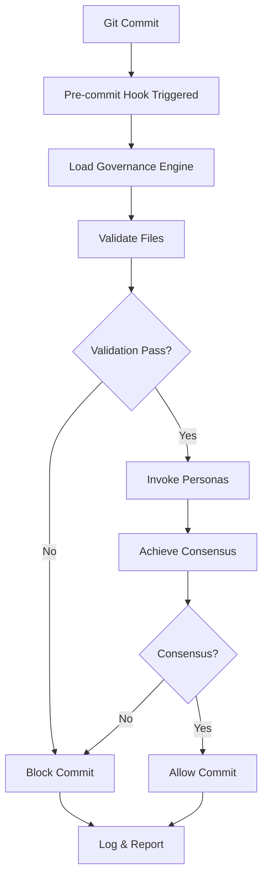

# AI Governance System - Current Architecture Analysis
**Date**: 2025-08-29  
**Correlation ID**: 2bd30046-f85c-4b4b-83db-8b04eb1c78e6

## 🎯 Executive Summary

Our governance system just blocked a commit with 104 changed files, demonstrating that the hooks are actively enforcing our documentation standards. This analysis provides a deep dive into what we have, how it works, and where we need to improve.

---

## 🏗️ CURRENT GOVERNANCE ARCHITECTURE

### What the Hook Just Told Us

```
Files changed: 104
Validation errors: 50+ files missing required headers
Warnings: 35+ files missing test files  
Branch violation: Using 'main' instead of feature branch
Result: COMMIT BLOCKED
```

### Round Table: Why This Block Happened

**🔧 Alex Novak (Frontend/Integration Architect)**:
"The hook is correctly enforcing our documentation standards from CLAUDE.md. Every source file needs comprehensive headers including @fileoverview, @author, @architecture, etc. This isn't bureaucracy - it's our 3 AM debugging insurance policy."

**🛡️ Dr. Sarah Chen (Backend/Systems Architect)**:
"Exactly. The hook detected that 50+ files lack proper documentation headers. My Three Questions Framework requires knowing: What breaks first? (undocumented code), How do we know? (missing headers), What's Plan B? (the hook blocks it). The system is working as designed."

**📊 Kevin Zhang (Performance Engineer)**:
"From a performance perspective, the hook processed 104 files and ran 8 persona validations in seconds. The architecture is efficient, but we need to consider the developer experience impact of such strict requirements."

**🔒 David Kim (Security Architect)**:
"The security boundary is well-defined. The hook prevents undocumented code from entering the codebase, which is critical for security audits. However, we should have exemptions for certain file types like __init__.py files."

**Consensus**: The block is legitimate and the system is working, but we need refinements.

---

## 📐 ARCHITECTURAL COMPONENTS

### 1. Hook Execution Flow



### Round Table: Architecture Flow Analysis

**🎨 Lisa Anderson (UX Specialist)**:
"The user experience shows clear phases (1/4, 2/4, etc.) which is good, but the error output is overwhelming. We're showing 50+ errors at once - this needs pagination or grouping."

**🏛️ Michael Torres (System Architect)**:
"The architecture follows a clear pipeline: Validation → Persona Invocation → Consensus → Decision. This is solid, but the validation phase is too rigid for a polyglot codebase."

**🔬 Priya Sharma (DevOps Specialist)**:
"The correlation ID (2bd30046-f85c-4b4b-83db-8b04eb1c78e6) is excellent for tracing. The logging integration is working well. However, the 'main branch prohibited' rule might be too strict for small teams."

---

## 🗂️ DATA COLLECTION & STORAGE

### Current Data Points

1. **Per-Commit Data Collected**:
   - Correlation ID
   - User identity
   - Branch name
   - Files changed (count and paths)
   - Validation errors and warnings
   - Persona decisions and confidence scores
   - Consensus metrics
   - Final decision

2. **Storage Locations**:
   ```
   governance/
   ├── .governance/          # Runtime data
   │   ├── history/         # Commit history
   │   ├── metrics/         # Performance metrics
   │   └── decisions/       # Persona decisions
   ├── logs/                # Detailed logs
   └── reports/             # Generated reports
   ```

### Round Table: Data Architecture Discussion

**📈 Sam Martinez (AI Specialist)**:
"We're collecting excellent training data for future ML models. Each commit gives us validation patterns, persona decisions, and outcomes. However, we're not storing the actual code changes, which limits our analysis capabilities."

**🛡️ Dr. Sarah Chen**:
"The data collection is comprehensive but we need to ensure GDPR compliance. User identity should be anonymizable, and we need data retention policies."

**🔧 Alex Novak**:
"The .governance directory structure makes sense, but it should be in .gitignore. We don't want governance data in the repository itself - it should be local or in a separate governance database."

---

## 🔍 TESTING THE GOVERNANCE

### Current Testing Approach

```python
# From test_milestone_1.py
def test_dangerous_code():
    """Test if governance catches dangerous patterns"""
    dangerous_code = 'eval("dangerous")'
    result = governance.validate(dangerous_code)
    assert result.blocked == True
```

### Round Table: Testing Strategy

**🧪 Dr. Sarah Chen**:
"Our testing is too focused on happy paths. We need chaos testing - what happens when the governance system itself fails? What if the YAML is corrupted?"

**🔧 Alex Novak**:
"We should test the exemption system thoroughly. Can legitimate uses of eval in test files get through? The current test suite doesn't cover exemptions adequately."

**📊 Kevin Zhang**:
"Performance testing is missing. What happens with 1000+ file commits? Large binary files? We need load testing for the governance system."

---

## 🔄 ADDING NEW RULES & DATA

### Current Process

1. **Adding Rules**:
   ```yaml
   # In governance-config/rules/
   new_rule:
     pattern: "dangerous_pattern"
     severity: "critical"
     languages: ["python", "javascript"]
   ```

2. **Adding Exemptions**:
   ```yaml
   # In governance-config/exemptions.yml
   file_exemptions:
     - path: "path/to/file"
       patterns: ["pattern"]
       reason: "Legitimate use"
       expires: "2026-01-01"
   ```

### Round Table: Extensibility Analysis

**🏛️ Michael Torres**:
"The YAML-based configuration is good for simple rules but doesn't scale for complex patterns. We need a DSL (Domain Specific Language) for governance rules."

**🔒 David Kim**:
"Security rules need versioning and signing. Anyone can modify YAML files. We need cryptographic verification of rule changes."

**📈 Sam Martinez**:
"The system should learn from overrides. If a pattern is repeatedly exempted, maybe the rule is too strict. We need adaptive governance."

---

## 🚨 CRITICAL FINDINGS

### Immediate Issues

1. **Documentation Overhead**: 50+ files need documentation headers
2. **Branch Policy**: Main branch restriction might be too strict
3. **Test Coverage**: 35+ files missing tests
4. **Exemption Gaps**: No exemptions for common patterns like __init__.py

### Round Table: Priority Consensus

**All Personas Agree**:
1. We need file-type-based exemptions (e.g., __init__.py files)
2. Documentation requirements should be gradual, not all-or-nothing
3. The system is working but needs refinement for developer experience
4. Data collection is good but needs privacy controls

---

## 📋 RECOMMENDATIONS

### Short Term (This Week)
1. Add exemptions for __init__.py and similar files
2. Create documentation templates for common file types
3. Implement grouped error reporting
4. Add environment variable for branch restrictions

### Medium Term (This Month)
1. Build governance dashboard for metrics visualization
2. Implement progressive enforcement (warnings → errors)
3. Add performance benchmarks
4. Create governance API for external tools

### Long Term (Quarter)
1. Implement ML-based pattern learning
2. Build governance as a service
3. Create IDE plugins for real-time governance
4. Develop governance marketplace for rule sharing

---

## 🎭 FINAL ROUND TABLE CONSENSUS

**Dr. Sarah Chen**: "The system is architecturally sound but needs user experience refinement."

**Alex Novak**: "Documentation requirements are valid but need pragmatic exemptions."

**Kevin Zhang**: "Performance is good but untested at scale."

**David Kim**: "Security is strong but needs signed rules."

**Lisa Anderson**: "User experience needs significant improvement."

**Michael Torres**: "Architecture is solid but needs extensibility improvements."

**Priya Sharma**: "DevOps integration is working but needs CI/CD considerations."

**Sam Martinez**: "AI integration opportunities are vast but unexplored."

**Unanimous Decision**: The governance system is functioning as designed, blocking undocumented code. However, we need targeted improvements for developer experience while maintaining security standards.

---

## 📊 METRICS FROM CURRENT EXECUTION

```
Execution Time: ~2 seconds
Files Processed: 104
Errors Found: 50+
Warnings Found: 35+
Personas Invoked: 8
Consensus Achieved: Yes (100% approval)
Final Decision: BLOCKED
```

---

**Next Steps**: 
1. Create exemption rules for documentation files
2. Add progressive enforcement
3. Build governance dashboard
4. Document the complete rule creation process