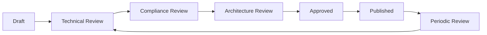

# 📚 Documentation Standards & Governance

**Version**: 1.0  
**Date**: January 27, 2025  
**Owner**: Quinn Roberts v1.1 - Compliance & Privacy Officer  
**Status**: MANDATORY - Enforced via Pre-commit Hooks  

---

## 📋 MANDATORY DOCUMENT HEADER

Every document MUST begin with:

```markdown
# [Document Title]

**Version**: X.Y  
**Date**: YYYY-MM-DD  
**Author**: [Persona Name and Version]  
**Reviewers**: [Alex Novak v3.0, Dr. Sarah Chen v1.2]  
**Status**: [Draft|Review|Approved|Deprecated]  
**Purpose**: [One-line description]  
**Audience**: [Target readers]  

---
```

## 📊 DOCUMENT CATEGORIES & REQUIREMENTS

### Architecture Documents
**Owner**: Alex Novak (Frontend) / Sarah Chen (Backend)
- **Format**: Markdown with Mermaid/PlantUML diagrams
- **Required Sections**:
  - Overview
  - Component Design
  - Data Flow
  - Security Boundaries
  - Failure Modes
  - Integration Points
- **Review Cycle**: Monthly
- **Compliance**: Must address GDPR data flow

### Testing Documents
**Owner**: Sam Martinez v3.2.0
- **Format**: Markdown with code examples
- **Required Sections**:
  - Test Strategy
  - Coverage Requirements
  - Test Categories
  - Performance Baselines
  - Chaos Scenarios
- **Review Cycle**: Per sprint
- **Compliance**: Must include security test cases

### API Documentation
**Owner**: Sarah Chen v1.2
- **Format**: OpenAPI 3.0 specification
- **Required Elements**:
  - Endpoint descriptions
  - Request/response schemas
  - Error codes
  - Rate limits
  - Authentication requirements
- **Review Cycle**: Per API change
- **Compliance**: Must document data retention

### Deployment Documentation
**Owner**: Riley Thompson v1.1
- **Format**: Markdown with YAML configurations
- **Required Sections**:
  - Infrastructure requirements
  - Deployment procedures
  - Rollback procedures
  - Monitoring setup
  - Security checklist
- **Review Cycle**: Per deployment
- **Compliance**: Must include audit logging

## 🔒 COMPLIANCE REQUIREMENTS

### Data Privacy Documentation
- **Personal Data Mapping**: Document all personal data flows
- **Retention Policies**: Specify data lifecycle
- **Access Controls**: Define who can access what
- **Audit Trail**: Document all data operations

### Security Documentation
- **Threat Model**: Required for all components
- **Security Controls**: Document implemented controls
- **Incident Response**: Required procedures
- **Vulnerability Management**: Tracking and remediation

### Audit Requirements
- **Change Log**: Every document must track changes
- **Approval Trail**: Two-architect approval required
- **Version Control**: Git history must be maintained
- **Review Evidence**: Comments and approval records

## ✅ VALIDATION RULES

### Pre-commit Checks
```bash
#!/bin/bash
# Document validation hook

# Check for mandatory header
if ! grep -q "Version:" "$1"; then
  echo "ERROR: Missing version in document header"
  exit 1
fi

if ! grep -q "Author:" "$1"; then
  echo "ERROR: Missing author in document header"
  exit 1
fi

if ! grep -q "Purpose:" "$1"; then
  echo "ERROR: Missing purpose in document header"
  exit 1
fi

# Check for compliance sections
if [[ "$1" == *"architecture"* ]]; then
  if ! grep -q "Security Boundaries" "$1"; then
    echo "ERROR: Architecture doc missing security boundaries"
    exit 1
  fi
fi
```

### Review Requirements
- **Technical Review**: By relevant specialist
- **Architecture Review**: By Alex or Sarah
- **Compliance Review**: By Quinn Roberts
- **Final Approval**: Both core architects

## 📝 DOCUMENT TEMPLATES

### Architecture Document Template
```markdown
# [Component Name] Architecture

**Version**: 1.0  
**Date**: YYYY-MM-DD  
**Author**: [Name]  
**Reviewers**: Alex Novak v3.0, Dr. Sarah Chen v1.2  
**Status**: Draft  
**Purpose**: Define architecture for [component]  
**Audience**: Development team  

---

## Overview
[High-level description]

## Component Design
[Detailed design with diagrams]

## Data Flow
[Data movement and transformations]

## Security Boundaries
[Security controls and boundaries]

## Failure Modes
[What breaks and how to handle it]

## Integration Points
[How this connects to other components]

## Performance Considerations
[Performance requirements and optimizations]

## Compliance Considerations
[GDPR, security, audit requirements]
```

## 🔄 DOCUMENT LIFECYCLE



## 📊 QUALITY METRICS

### Documentation Health Score
- **Completeness**: All required sections present (25%)
- **Currency**: Updated within review cycle (25%)
- **Compliance**: Meets regulatory requirements (25%)
- **Accessibility**: Clear and findable (25%)

### Target Metrics
- Documentation coverage: >90% of components
- Review compliance: 100% within cycle
- Approval time: <48 hours
- Findability: <3 clicks from index

## 🚨 ENFORCEMENT

### Consequences of Non-Compliance
1. **Warning**: First violation - documentation review required
2. **Block**: Second violation - PR blocked until resolved
3. **Escalation**: Third violation - Architecture review required

### Exemptions
- Emergency hotfixes (must document within 24 hours)
- Security patches (must document within 48 hours)
- Approved by both core architects

---

**Enforcement Status**: ACTIVE  
**Validation**: Automated via pre-commit hooks  
**Compliance**: Monitored by Quinn Roberts  
**Next Review**: February 27, 2025